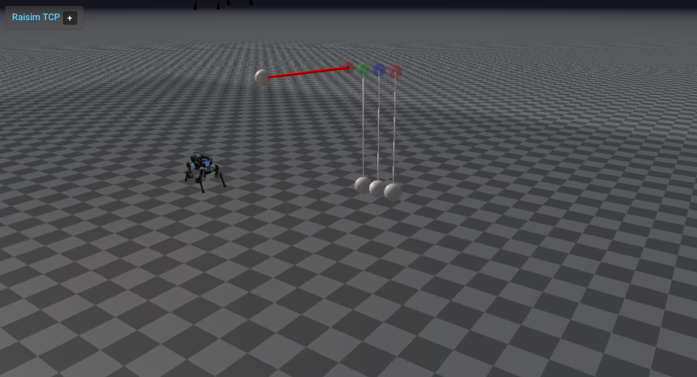

#################################################
Server Example: Length Constraints Newtons Cradle
#################################################

Overview
========
Creates a Newton's cradle with stiff and compliant wires, adds robots, and exports the world to XML. It is the main reference for length constraints and wire APIs.

Screenshot
==========

Target
======
CMake target: ``length_constraints_newtons_cradle``.

Run
====
Run the build-tree executable:

.. code-block:: bash

   ./build-examples/examples/length_constraints_newtons_cradle

On Windows, run ``length_constraints_newtons_cradle.exe`` instead.
This example uses RaisimServer. Start ``rayrai_tcp_viewer`` and connect to port 8080.

Details
=======
- Builds a Newton's cradle with stiff wires and steel balls.
- Adds compliant and custom wires attached to a box and robots.
- Exports the world to XML and removes a custom wire mid-simulation.

