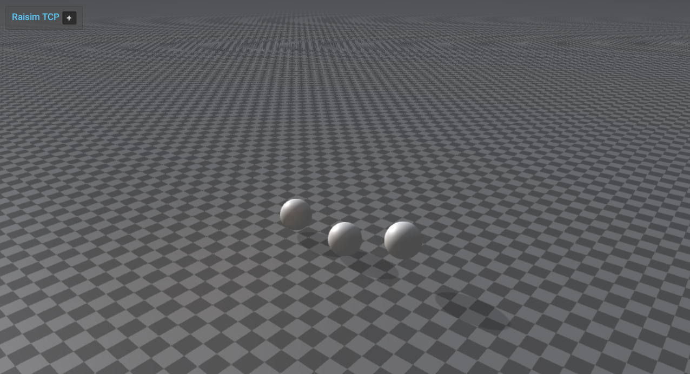

####################################
Server Example: Material Restitution
####################################

Overview
========
Drops spheres with different material labels (steel, rubber, copper) and configures material pair properties. It highlights restitution and friction differences.

Screenshot
==========

Binary
======
Installed executable: ``material_restitution``.

Run
====
Run the installed executable:

.. code-block:: bash

   <raisim-install>/bin/material_restitution

On Windows, run ``material_restitution.exe`` instead.
This example uses RaisimServer. Start the rayrai TCP viewer and connect to port 8080. RaisimUnity and RaisimUnreal are no longer supported.

Details
=======
- Drops three spheres with different materials onto a steel ground.
- Sets per-material restitution to compare bounce behavior.
- Reference for ``World::setMaterialPairProp`` restitution settings.

