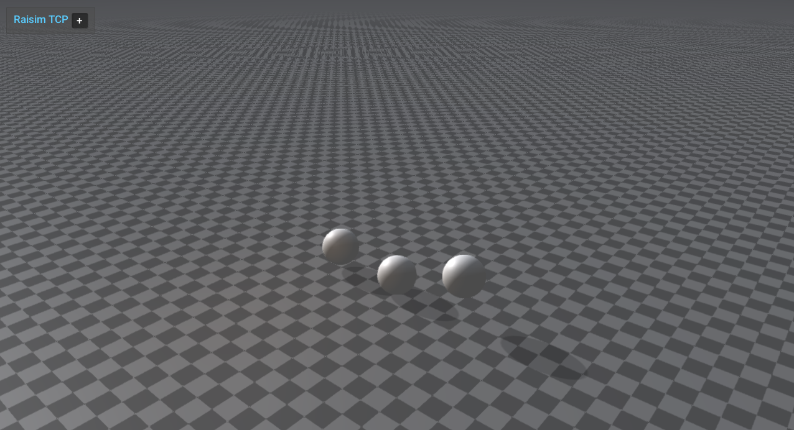

####################################
Server Example: Material Restitution
####################################

Overview
========
Drops spheres with different material labels (steel, rubber, copper) and configures material pair properties. It highlights restitution and friction differences.

Screenshot
==========

Target
======
CMake target: ``material_restitution``.

Run
====
Run the build-tree executable:

.. code-block:: bash

   ./build-examples/examples/material_restitution

On Windows, run ``material_restitution.exe`` instead.
This example uses RaisimServer. Start ``rayrai_tcp_viewer`` and connect to port 8080.

Details
=======
- Drops three spheres with different materials onto a steel ground.
- Sets per-material restitution to compare bounce behavior.
- Reference for ``World::setMaterialPairProp`` restitution settings.

