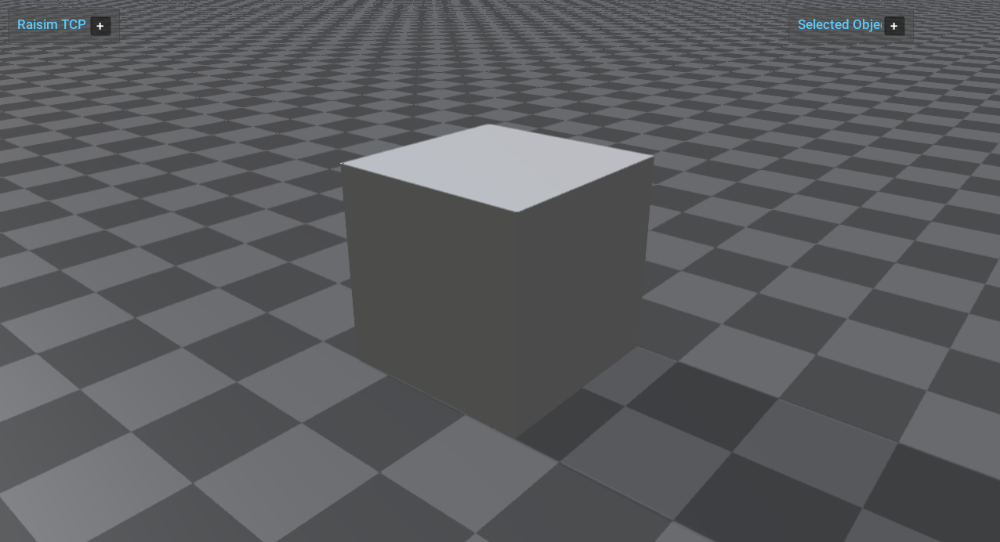

########################################
Server Example: Material Static Friction
########################################

Overview
========
Compares static and dynamic friction by pushing a box across a ground plane. Material properties are loaded from XML to demonstrate material file usage.

Screenshot
==========

Binary
======
Installed executable: ``material_static_friction``.

Run
====
Run the installed executable:

.. code-block:: bash

   <raisim-install>/bin/material_static_friction

On Windows, run ``material_static_friction.exe`` instead.
This example uses RaisimServer. Start ``rayrai_raisim_tcp_viewer`` and connect to port 8080.

Details
=======
- Applies constant force to a box to show static vs dynamic friction.
- Loads material properties from an XML file.
- Prints console hints when friction regime changes.

