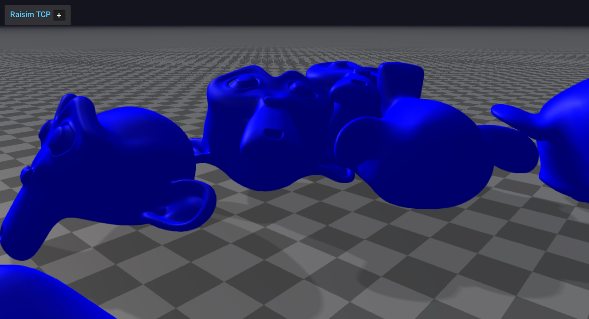

##########################
Server Example: Mesh Stack
##########################

Overview
========
Loads a mesh (the monkey OBJ) multiple times and stacks them in a grid. This demonstrates mesh loading, placement, and appearance settings.

Screenshot
==========

Binary
======
Installed executable: ``mesh_stack``.

Run
====
Run the installed executable:

.. code-block:: bash

   <raisim-install>/bin/mesh_stack

On Windows, run ``mesh_stack.exe`` instead.
This example uses RaisimServer. Start the rayrai TCP viewer and connect to port 8080. RaisimUnity and RaisimUnreal are no longer supported.

Details
=======
- Loads a mesh (monkey.obj) and stacks it in a 3x3 grid.
- Adjusts ERP and timestep for stable stacking.
- Positions the camera for a clear view of the pile.

