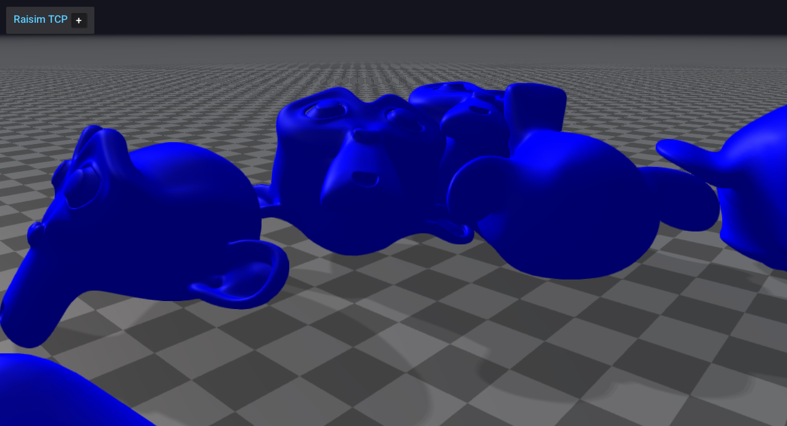

##########################
Server Example: Mesh Stack
##########################

Overview
========
Loads a mesh (the monkey OBJ) multiple times and stacks them in a grid. This demonstrates mesh loading, placement, and appearance settings.

Screenshot
==========

Target
======
CMake target: ``mesh_stack``.

Run
====
Run the build-tree executable:

.. code-block:: bash

   ./build-examples/examples/mesh_stack

On Windows, run ``mesh_stack.exe`` instead.
This example uses RaisimServer. Start ``rayrai_tcp_viewer`` and connect to port 8080.

Details
=======
- Loads a mesh (monkey.obj) and stacks it in a 3x3 grid.
- Adjusts ERP and timestep for stable stacking.
- Positions the camera for a clear view of the pile.

