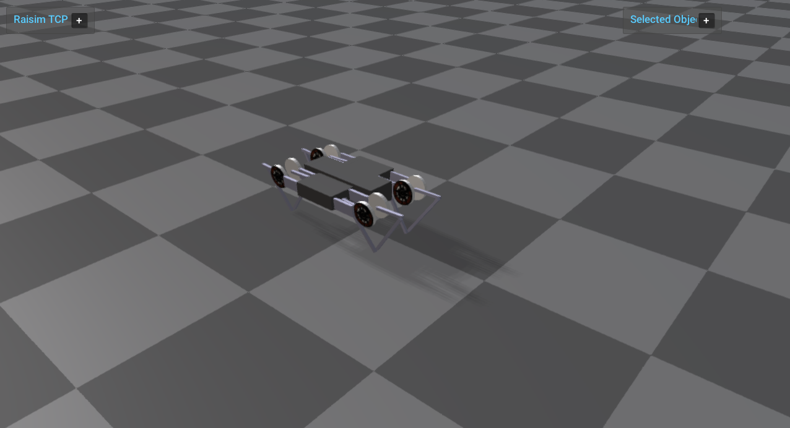

###########################
Server Example: Minitaur PD
###########################

Overview
========
Runs Minitaur with PD control, including per-joint gains that zero out unactuated joints. It is a compact reference for legged robot PD setup.

Screenshot
==========

Binary
======
Installed executable: ``minitaur_pd``.

Run
====
Run the installed executable:

.. code-block:: bash

   <raisim-install>/bin/minitaur_pd

On Windows, run ``minitaur_pd.exe`` instead.
This example uses RaisimServer. Start the rayrai TCP viewer and connect to port 8080. RaisimUnity and RaisimUnreal are no longer supported.

Details
=======
- Loads the Minitaur URDF (closed-loop) and applies PD to actuated joints.
- Sets gains to zero for unactuated joints in the closed-loop model.
- Focuses the camera on the robot to show posture stability.

