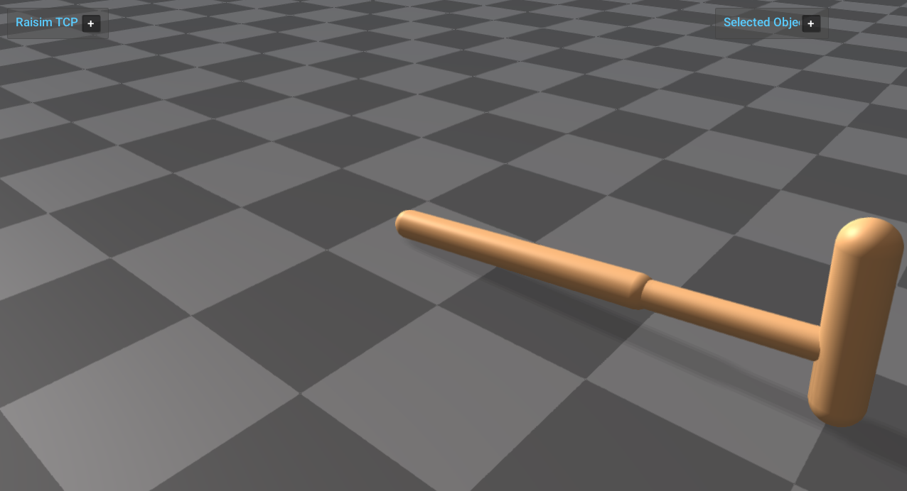

mjcf_gymnasium_hopper
=====================

Loads the Gymnasium Hopper MuJoCo XML asset through ``raisim::World`` and
publishes it through ``raisim::RaisimServer``. This example replaces the former
minimal hinge example with a floating-base model that has slide, hinge, capsule,
plane, default, material, and actuator sections in the source MJCF.

Run:

.. code-block:: bash

   <raisim-install>/bin/mjcf_gymnasium_hopper

Start ``rayrai_tcp_viewer`` in another terminal to visualize the server
scene.

What it demonstrates:

- Loading ``rsc/mjcf/gymnasium/hopper.xml`` with ``raisim::World``.
- Retrieving the loaded articulated system by its MJCF root body name.
- Applying a small procedural torque pattern through the normal RaiSim control
  path.
