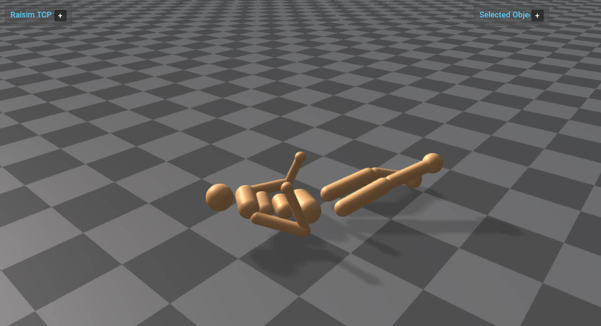

mjcf_gymnasium_humanoid
=======================

Loads the Gymnasium Humanoid MuJoCo XML asset through ``raisim::World`` and
runs it through ``raisim::RaisimServer``. The example starts the humanoid in a
nonzero joint configuration with the base raised about 1 m above the standing
pose, then drops it under gravity with zero applied generalized force.

Run:

.. code-block:: bash

   <raisim-install>/bin/mjcf_gymnasium_humanoid

Start ``rayrai_tcp_viewer`` in another terminal to visualize the server
scene.

What it demonstrates:

- Loading ``rsc/mjcf/gymnasium/humanoid.xml`` with ``raisim::World``.
- Handling a larger MJCF articulated system with a free root and many child
  bodies.
- Setting an initial free-root pose and nonzero joint configuration before
  dropping the model under gravity.
