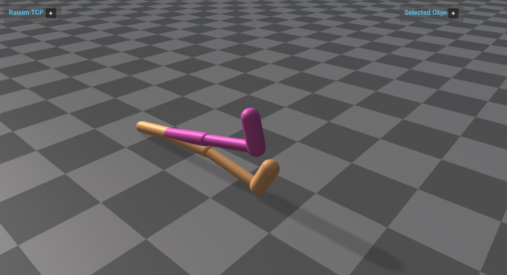

mjcf_gymnasium_walker2d
=======================

Loads the Gymnasium Walker2d MuJoCo XML asset through ``raisim::World`` and
runs it through ``raisim::RaisimServer``. The vendored Walker2d XML keeps the
Gymnasium model structure but enables the default geom collision affinity so
RaiSim creates collision bodies for the articulated links.

Run:

.. code-block:: bash

   <raisim-install>/bin/mjcf_gymnasium_walker2d

Start ``rayrai_tcp_viewer`` in another terminal to visualize the server
scene.

What it demonstrates:

- Loading ``rsc/mjcf/gymnasium/walker2d.xml`` with ``raisim::World``.
- Handling a multi-link MJCF articulated system with contact-enabled geoms.
- Applying a small procedural torque pattern to the non-root joints.
