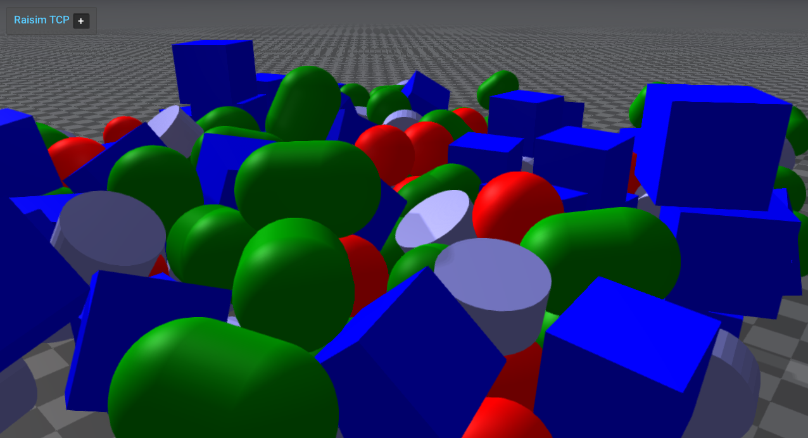

##############################
Server Example: Primitive Grid
##############################

Overview
========
Spawns a grid of boxes, spheres, capsules, and cylinders to show the basic primitive creation APIs. It is a quick visual check for simple shapes and placements.

Screenshot
==========

Binary
======
Installed executable: ``primitive_grid``.

Run
====
Run the installed executable:

.. code-block:: bash

   <raisim-install>/bin/primitive_grid

On Windows, run ``primitive_grid.exe`` instead.
This example uses RaisimServer. Start the rayrai TCP viewer and connect to port 8080. RaisimUnity and RaisimUnreal are no longer supported.

Details
=======
- Creates a 3D lattice of boxes, spheres, capsules, and cylinders.
- Assigns per-shape colors and positions them in a grid.
- Useful for collision/rendering sanity checks.

