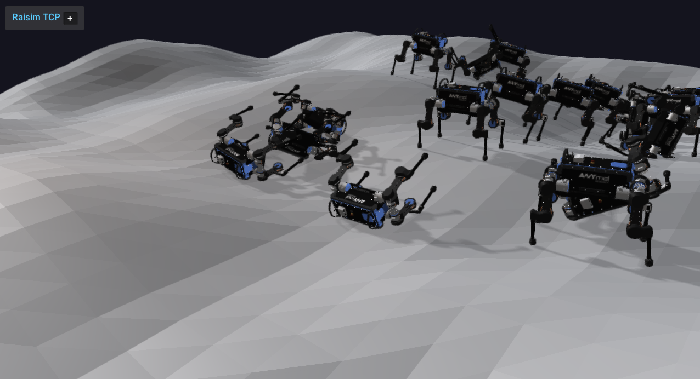

####################################
Server Example: Procedural Heightmap
####################################

Overview
========
Creates a procedural heightmap and places ANYmal on top. Use this to see how to configure fractal terrain properties and run a robot on generated terrain.

Screenshot
==========

Target
======
CMake target: ``procedural_heightmap``.

Run
====
Run the build-tree executable:

.. code-block:: bash

   ./build-examples/examples/procedural_heightmap

On Windows, run ``procedural_heightmap.exe`` instead.
This example uses RaisimServer. Start ``rayrai_tcp_viewer`` and connect to port 8080.

Details
=======
- Generates terrain from ``TerrainProperties`` (fractal noise).
- Spawns ANYmal on the heightmap with PD control.
- Demonstrates procedural heightmap creation and appearance.

