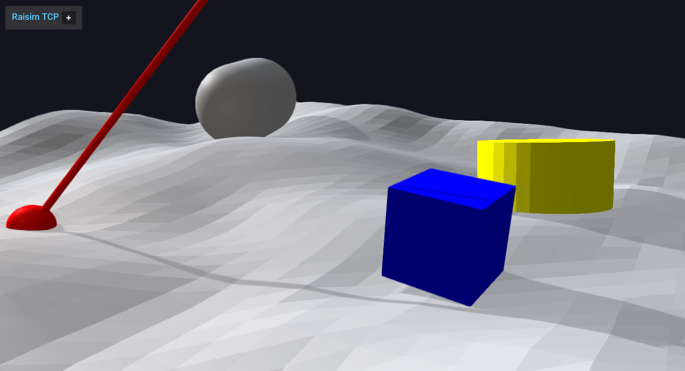

###########################
Server Example: Ray Casting
###########################

Overview
========
Performs a ray test from a fixed origin, then visualizes the hit point with a polyline and a sphere. Use it as the simplest reference for ray casting.

Screenshot
==========

Binary
======
Installed executable: ``ray_casting``.

Run
====
Run the installed executable:

.. code-block:: bash

   <raisim-install>/bin/ray_casting

On Windows, run ``ray_casting.exe`` instead.
This example uses RaisimServer. Start ``rayrai_raisim_tcp_viewer`` and connect to port 8080.

Details
=======
- Casts a single ray from a fixed origin each frame.
- Visualizes the hit point with a polyline and marker sphere.
- Uses ``World::rayTest`` against terrain and primitives.

