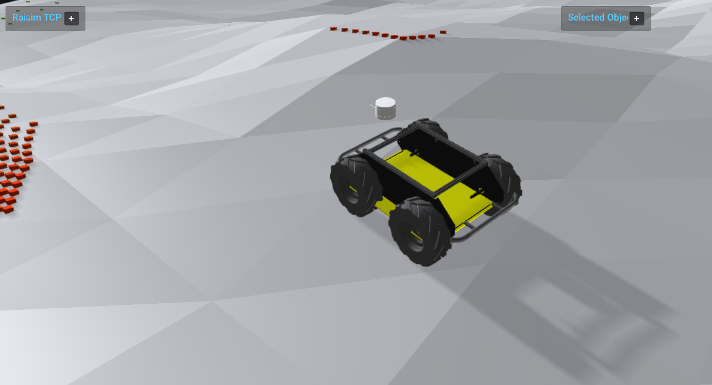

##############################
Server Example: Ray Scan LiDAR
##############################

Overview
========
Sweeps rays from a robot frame to emulate a LiDAR scan and visualizes hits with instanced boxes. This is a compact example of ray-based sensing.

Screenshot
==========

Binary
======
Installed executable: ``ray_scan_lidar``.

Run
====
Run the installed executable:

.. code-block:: bash

   <raisim-install>/bin/ray_scan_lidar

On Windows, run ``ray_scan_lidar.exe`` instead.
This example uses RaisimServer. Start ``rayrai_raisim_tcp_viewer`` and connect to port 8080.

Details
=======
- Sweeps a yaw/pitch grid and uses ``rayTest`` to emulate LiDAR.
- Displays scan points as instanced boxes colored by range.
- Uses an IMU frame for ray orientation and resets the robot when out of bounds.

