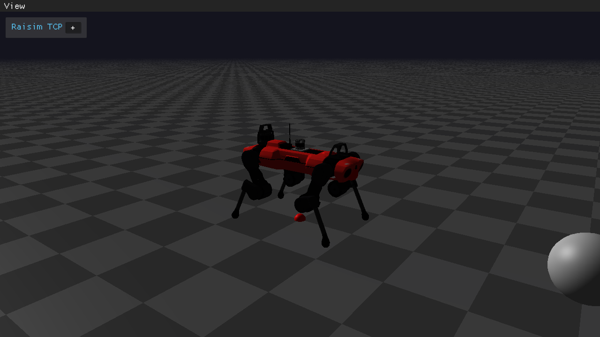

############################
Server Example: Sensor Suite
############################

Overview
========
Demonstrates camera, depth, IMU, and LiDAR sensors on ANYmal, including depth-to-point cloud conversion and point cloud visualization. It is the main reference for sensor APIs.

Screenshot
==========

Source Status
=============
Source file: ``examples/src/server/sensor_suite.cpp``.

This page is excluded from the published docs, and the current examples CMake
file does not register this source as an installed executable. Treat it as a
source reference unless you register it in a local examples build.

For visualization, use ``rayrai_raisim_tcp_viewer`` with RaisimServer-based
applications.

Details
=======
- Loads ANYmal with RGB, depth, IMU, and LiDAR sensors.
- Uses VISUALIZER measurement source for cameras and converts depth to point clouds.
- Visualizes LiDAR scans through point-cloud data sent to the viewer.

