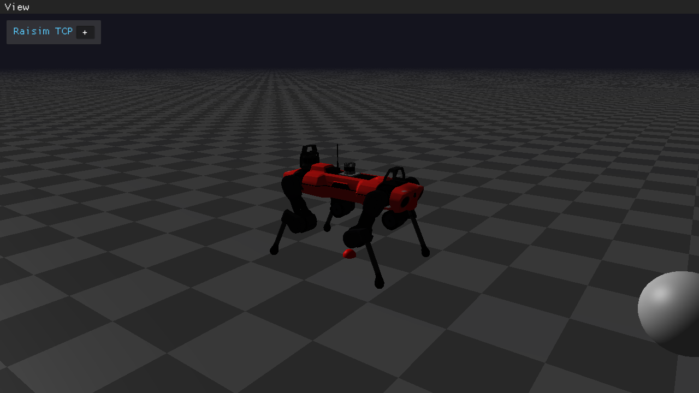

############################
Server Example: Sensor Suite
############################

Overview
========
Demonstrates camera, depth, IMU, and LiDAR sensors on ANYmal, including depth-to-point cloud conversion and point cloud visualization. It is the main reference for sensor APIs.

Screenshot
==========

Target And Source
=================

CMake target: ``sensor_suite``.

Source file: ``examples/src/server/sensor_suite.cpp``.

Run the packaged viewer and then the build-tree example:

.. code-block:: bash

   ./rayrai/bin/rayrai_raisim_tcp_viewer
   ./build-examples/examples/sensor_suite

Details
=======
- Loads ANYmal with RGB, depth, IMU, and LiDAR sensors.
- Configures the RGB and depth cameras with ``MeasurementSource::MANUAL``.
  The source includes a commented switch to RaiSim CPU depth for the front
  depth camera.
- Converts a depth array to 3D points and reads the RaiSim LiDAR/IMU sensors.
- Streams a rolling LiDAR point cloud and two diagnostic points through
  ``RaisimServer``.
