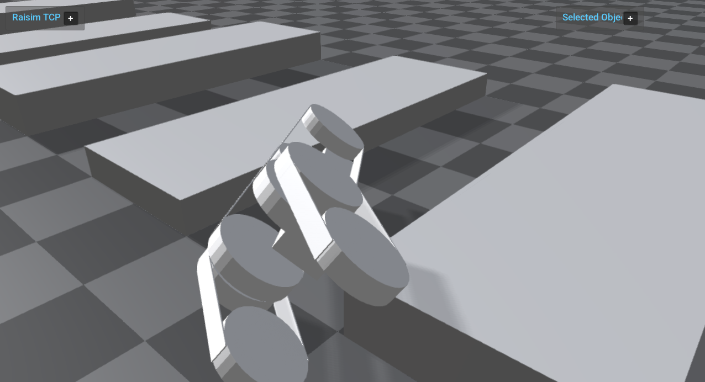

#######################################
Server Example: Templated Tracked Robot
#######################################

Overview
========
Loads a templated tracked robot URDF with parameter overrides and drives wheels/flippers using PD targets. It shows how to customize URDF parameters programmatically.

Screenshot
==========

Binary
======
Installed executable: ``templated_tracked_robot``.

Run
====
Run the installed executable:

.. code-block:: bash

   <raisim-install>/bin/templated_tracked_robot

On Windows, run ``templated_tracked_robot.exe`` instead.
This example uses RaisimServer. Start ``rayrai_raisim_tcp_viewer`` and connect to port 8080.

Details
=======
- Instantiates a templated tracked robot URDF with parameter overrides.
- Applies PD control to wheels and flippers while resetting track joints.
- Adds a sequence of box obstacles in front of the robot.

