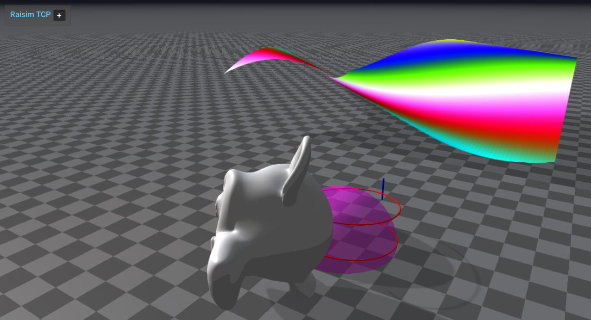

#######################################
Server Example: Visual Objects Showcase
#######################################

Overview
========
Adds visual primitives, meshes, arrows, polylines, dynamic meshes, and a visual heightmap through the server API. It demonstrates the visualization helpers and dynamic updates.

Screenshot
==========

Binary
======
Installed executable: ``visual_objects_showcase``.

Run
====
Run the installed executable:

.. code-block:: bash

   <raisim-install>/bin/visual_objects_showcase

On Windows, run ``visual_objects_showcase.exe`` instead.
This example uses RaisimServer. Start the rayrai TCP viewer and connect to port 8080. RaisimUnity and RaisimUnreal are no longer supported.

Details
=======
- Adds visual-only primitives, meshes, arrows, polylines, and a visual heightmap.
- Updates colors/sizes and dynamic mesh data every frame.
- Shows visual articulated systems and custom mesh streaming.

