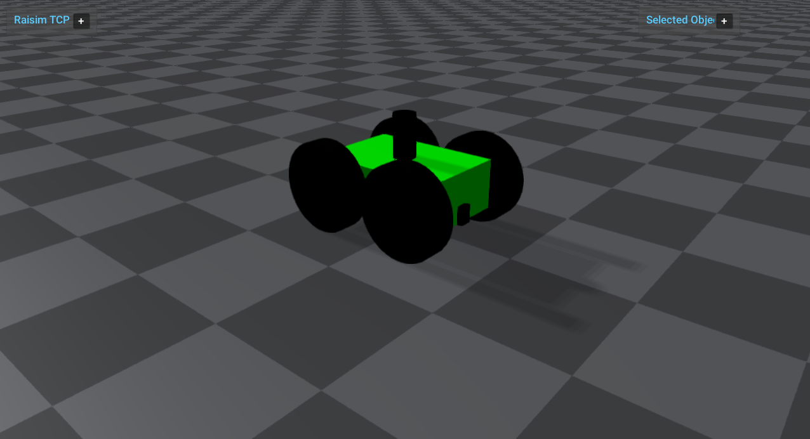

###########################################
Server Example: Wheeled Robot Force Control
###########################################

Overview
========
Loads a wheeled robot (SMB/megabot) and applies wheel forces in force-control mode. Use it to see a basic wheeled robot setup.

Screenshot
==========

Binary
======
Installed executable: ``wheeled_robot_force_control``.

Run
====
Run the installed executable:

.. code-block:: bash

   <raisim-install>/bin/wheeled_robot_force_control

On Windows, run ``wheeled_robot_force_control.exe`` instead.
This example uses RaisimServer. Start ``rayrai_raisim_tcp_viewer`` and connect to port 8080.

Details
=======
- Loads the SMB wheeled robot and applies constant wheel torques.
- Uses ``FORCE_AND_TORQUE`` control mode with semi-implicit integration.
- Focuses the camera on the robot for rollout.

