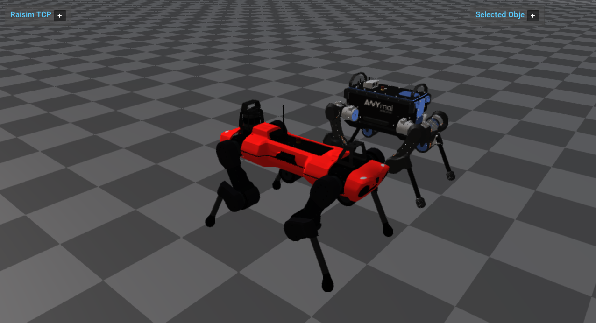

############################
ANYmal Pair
############################

Overview
========
Runs two ANYmal variants (B and C) with PD control in a world scene. This example is a compact reference for loading multiple quadruped URDFs and visualizing them through RaisimServer.

Screenshot
==========

Binary
======
Installed executable: ``anymal_pair``.

Run
====
Run the installed executable:

.. code-block:: bash

   <raisim-install>/bin/anymal_pair

On Windows, run ``anymal_pair.exe`` instead.
This example uses RaisimServer. Start the rayrai TCP viewer and connect to port 8080. RaisimUnity and RaisimUnreal are no longer supported.

Details
=======
- Loads ANYmal B and C URDFs and applies PD targets for all leg joints.
- Uses a checkerboard ground and focuses on anymalC.
- Runs the world through the standard RaisimServer object stream.

