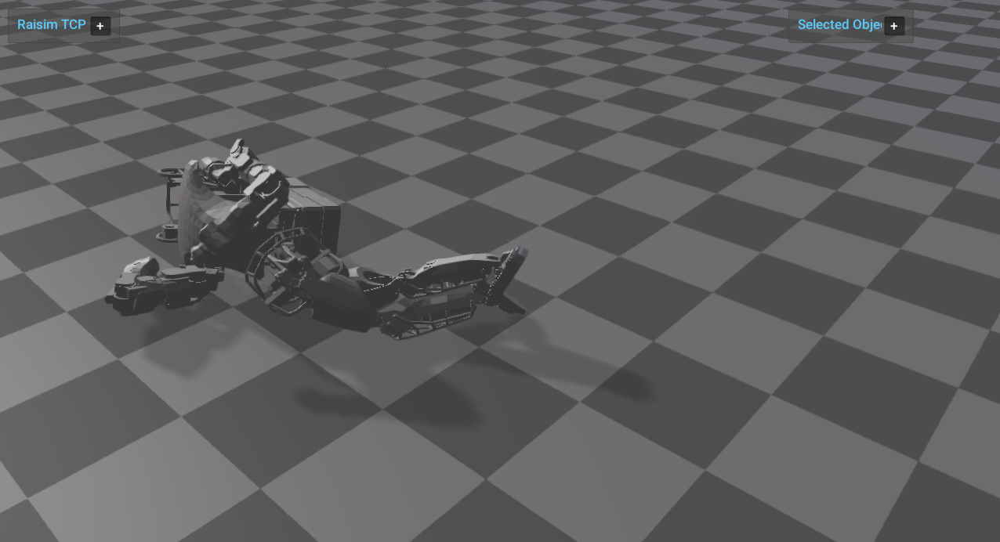

#####################
Atlas
#####################

Overview
========
Spawns Atlas in a world scene and applies external force and torque to perturb the robot. This example demonstrates a larger articulated system streamed through RaisimServer.

Screenshot
==========

Binary
======
Installed executable: ``atlas``.

Run
====
Run the installed executable:

.. code-block:: bash

   <raisim-install>/bin/atlas

On Windows, run ``atlas.exe`` instead.
This example uses RaisimServer. Start ``rayrai_raisim_tcp_viewer`` and connect to port 8080.

Details
=======
- Spawns Atlas robots and initializes the base pose with zero joint torques.
- Applies external force/torque each frame to perturb the robot.
- Uses a checkerboard ground so the TCP viewer's reflective ground option is visible.
- Focuses the TCP viewer on the robot.

