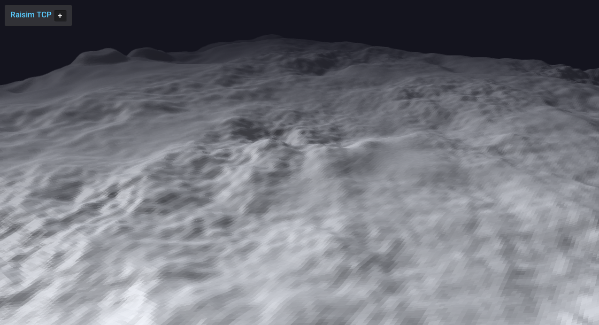

################################
Hill1 Heightmap
################################

Overview
========
Loads the hill1 heightmap and drops Aliengo high above the terrain to demonstrate heightmap placement and scale. 

Screenshot
==========

Binary
======
Installed executable: ``hill1_heightmap``.

Run
====
Run the installed executable:

.. code-block:: bash

   <raisim-install>/bin/hill1_heightmap

On Windows, run ``hill1_heightmap.exe`` instead.
This example uses RaisimServer. Start ``rayrai_raisim_tcp_viewer`` and connect to port 8080.

Details
=======
- Loads the hill1 heightmap PNG with explicit scale/offset.
- Drops Aliengo from height and holds posture with PD gains.
- Focuses the camera on the robot.

