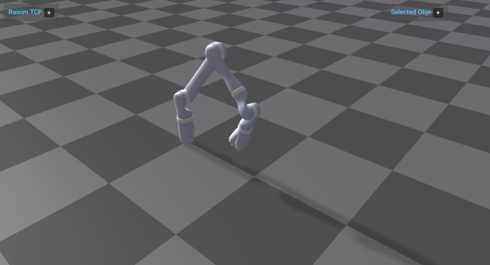

#########################
Kinova Arm
#########################

Overview
========
Loads the Kinova arm, applies joint PD gains and targets, and runs it on flat ground. This example focuses on manipulator setup and joint-level control.

Binary
======
Installed executable: ``kinova_arm``.

Run
====
Run the installed executable:

.. code-block:: bash

   <raisim-install>/bin/kinova_arm

On Windows, run ``kinova_arm.exe`` instead.
This example uses RaisimServer. Start ``rayrai_raisim_tcp_viewer`` and connect to port 8080.

Details
=======
- Loads the Kinova arm URDF on flat ground and applies joint PD gains/targets.
- Uses a simple scene for fast rendering.
- Focuses the camera on the arm for a fixed-base articulation demo.

