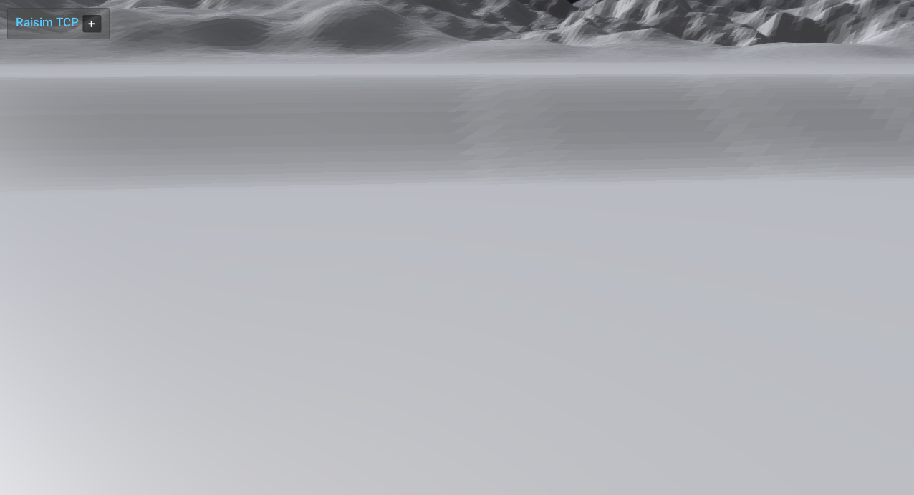

################################
Lake1 Heightmap
################################

Overview
========
Uses the lake1 heightmap image and spawns Aliengo to walk on the terrain. This example shows how to configure heightmap scaling for a large outdoor scene.

Screenshot
==========

Binary
======
Installed executable: ``lake1_heightmap``.

Run
====
Run the installed executable:

.. code-block:: bash

   <raisim-install>/bin/lake1_heightmap

On Windows, run ``lake1_heightmap.exe`` instead.
This example uses RaisimServer. Start the rayrai TCP viewer and connect to port 8080. RaisimUnity and RaisimUnreal are no longer supported.

Details
=======
- Loads the lake1 heightmap PNG with scale/offset.
- Spawns Aliengo with PD posture control at a low start height.
- Focuses on the robot.

