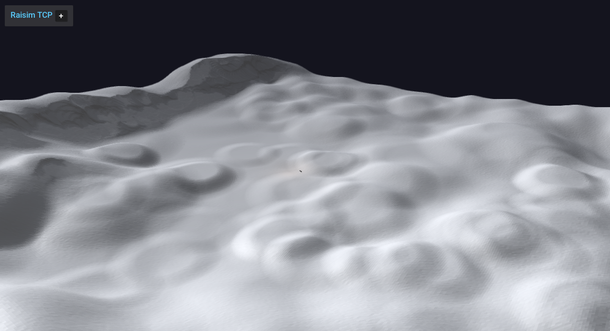

####################################
Mountain1 Heightmap
####################################

Overview
========
Loads the mountain1 heightmap  and drops an Aliengo robot on it with PD control. 

Screenshot
==========

Binary
======
Installed executable: ``mountain1_heightmap``.

Run
====
Run the installed executable:

.. code-block:: bash

   <raisim-install>/bin/mountain1_heightmap

On Windows, run ``mountain1_heightmap.exe`` instead.
This example uses RaisimServer. Start ``rayrai_raisim_tcp_viewer`` and connect to port 8080.

Details
=======
- Loads the mountain1 heightmap PNG with scale/offset.
- Spawns Aliengo with PD posture control.
- Focuses on the robot.

