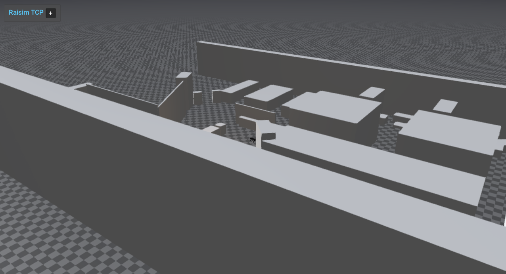

############################
Office1 Scene
############################

Overview
========
Loads the office1 XML world, adds a dynamic ball, and spawns Aliengo with PD control. 

Screenshot
==========

Binary
======
Installed executable: ``office1_scene``.

Run
====
Run the installed executable:

.. code-block:: bash

   <raisim-install>/bin/office1_scene

On Windows, run ``office1_scene.exe`` instead.
This example uses RaisimServer. Start the rayrai TCP viewer and connect to port 8080. RaisimUnity and RaisimUnreal are no longer supported.

Details
=======
- Loads the office1 XML world and adds a moving sphere.
- Spawns Aliengo with PD posture control on top of the scene.
- Focuses the camera on the robot.

