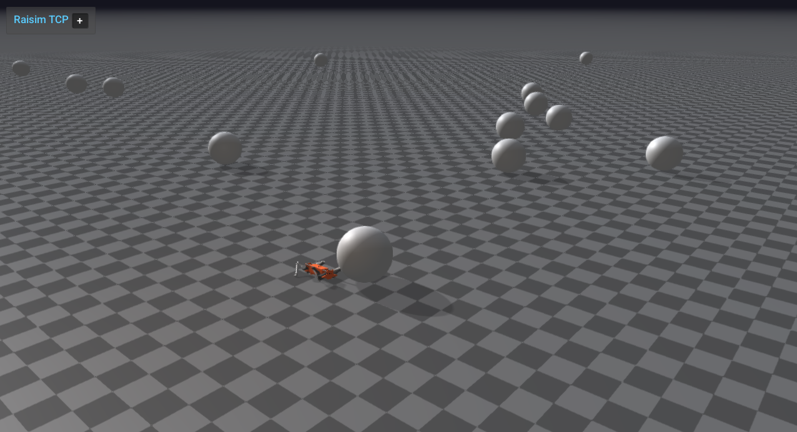

############################
XML Example: Templated World
############################

Overview
========
Instantiates a templated XML world with parameter overrides (spawn options, counts, offsets). Use this to see how parameterized XML files can generate variants of a scene without duplicating the XML.

Binary
======
Installed executable: ``xml_templated_world``.

Run
====
Run the installed executable:

.. code-block:: bash

   <raisim-install>/bin/xml_templated_world

On Windows, run ``xml_templated_world.exe`` instead.
This example uses RaisimServer. Start the rayrai TCP viewer and connect to port 8080. RaisimUnity and RaisimUnreal are no longer supported.

Details
=======
- Loads a templated XML world and overrides parameters at runtime.
- Uses ``World::ParameterContainer`` to set spawn flags and counts.
- Runs the scene with RaisimServer for visualization.

