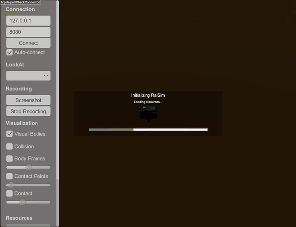

#########################
XML Example: World Loader
#########################

Overview
========
Provides a small editable source template for loading a world XML file and
running a ``RaisimServer`` session. It is not a generic command-line XML
loader: the shipped public example keeps its ``xmlScript`` constant empty and exits
after printing an instruction.

Screenshot
==========

Target
======
CMake target: ``xml_world_loader``.

Run
====
To use the template, set ``xmlScript`` in
``examples/src/xml/xml_world_loader.cpp`` to a path relative to
``rsc/xmlScripts``, rebuild the target, and run:

.. code-block:: bash

   cmake --build build-examples --target xml_world_loader --parallel 12
   ./build-examples/examples/xml_world_loader

On Windows, run ``xml_world_loader.exe`` instead.
This example uses RaisimServer. Start ``rayrai_tcp_viewer`` and connect to port 8080.

Details
=======
- Resolves the selected file below the copied ``rsc/xmlScripts`` directory.
- Constructs ``raisim::World`` from that XML path and publishes it through
  ``RaisimServer``.
- Does not parse command-line arguments or record video in the shipped example.

For application code that already has a path, construct the world directly:

.. code-block:: cpp

   raisim::World world("/absolute/path/to/world.xml");
