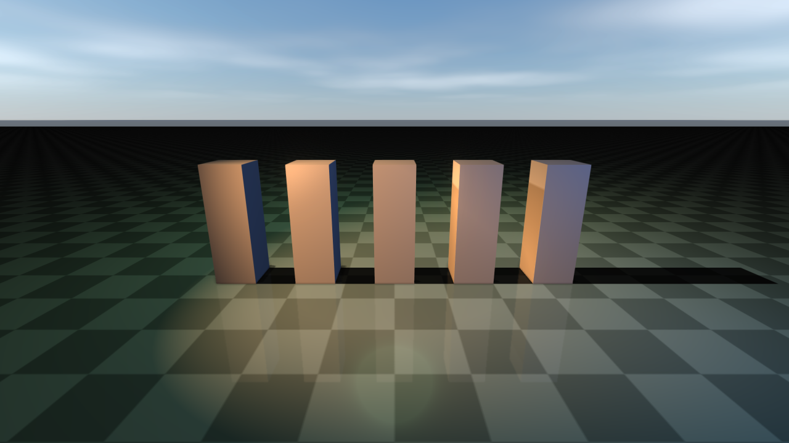

##############################
Lighting, shadows, and HDR/IBL
##############################

This page covers the main directional light, additional spot/point/area lights,
shadow budgets, HDR/image-based lighting, and reflection probes. For the
overall render-quality preset that controls shadow defaults, see
:doc:`RenderQuality`. For weather-driven lighting (sun position over time of
day, lightning, cloud shadows) see :doc:`Weather`.

Shadows and lights
==================
rayrai has a fast single-main-light path for robotics workloads and a higher-quality
multi-light path for authored visual scenes. The main light is a directional light and
is always the cheapest shadow-casting source. Imported glTF/Blender scenes can also
use additional directional, point, spot, and area-style lights.

Shadow defaults are tuned so a directional shadow is clearly visible without
any per-application setup. Every preset uses a compact directional shadow
ortho box (``halfSize=12.5``, ``near=0.1``, ``far=55``) and a single
cascade, which keeps each shadow-map texel small enough that the resulting
shadow stays crisp even with bright IBL fill. ``mainLightAmbient`` is low
(``≈ 0.2-0.3`` per preset), ``mainLightDiffuse`` is high (``≈ 1.4-1.65``)
and ``shadowStrength`` is high (``0.75-0.90``). Raise ``mainLightAmbient``
or lower ``shadowStrength`` for a flatter indoor look; the defaults are
aimed at outdoor daylight.

By default, the main shadow center tracks a point in front of the camera and the shadow
box is fixed in size. You can customize both via ``RayraiWindow``:

.. code-block:: cpp

    // shadow center is N meters ahead of the camera (default: 10.0)
    viewer.setShadowCenterOffset(12.0f);
    // shadow box (default: halfSize=12.5, near=0.1, far=55.0)
    viewer.setShadowOrtho(20.0f, 0.1f, 80.0f);

If you need a fully custom shadow view/projection, use the lower-level
``raisin::Light`` API directly.

Additional lights are controlled explicitly and capped so the fast path stays fast.
Rayrai currently supports up to ``RayraiWindow::kMaxAdditionalLights`` additional lights
and up to ``RayraiWindow::kMaxAdditionalShadowLights`` additional shadow maps. Directional,
spot, and area-style lights use 2D shadow maps. Point lights use cubemap shadow maps.
Shadow framebuffer setup validates the current OpenGL context and recreates stale
framebuffer/texture names when a viewer context is rebuilt; this matters for TCP-viewer
lifetime, offscreen tests, and applications that create/destroy render contexts.
For imported scenes, ``RenderQualitySettings::autoSelectImportedShadowLight`` can promote
the strongest imported light to the main shadow caster, while the remaining shadow budget
is assigned to additional lights.

.. code-block:: cpp

    raisin::RayraiWindow::AdditionalLight fill;
    fill.type = raisin::LightType::DIRECTIONAL;
    fill.direction = glm::normalize(glm::vec3(0.4f, -0.2f, -0.8f));
    fill.diffuse = glm::vec3(0.10f, 0.12f, 0.16f);
    viewer.addAdditionalLight(fill);

    raisin::RayraiWindow::AdditionalLight spot;
    spot.type = raisin::LightType::SPOT;
    spot.position = glm::vec3(1.8f, -1.6f, 2.6f);
    spot.direction = glm::normalize(glm::vec3(-1.4f, 1.0f, -1.8f));
    spot.diffuse = glm::vec3(0.18f, 0.42f, 1.0f);
    spot.spotInnerCos = std::cos(glm::radians(14.0f));
    spot.spotOuterCos = std::cos(glm::radians(28.0f));
    // Optional spotlight projector cookie, color temperature, and distance fade.
    spot.projectorMap = projectorTextureId;
    spot.temperatureEnabled = true;
    spot.temperatureKelvin = 4200.0f;
    spot.distanceFadeEnabled = true;
    spot.distanceFadeBegin = 18.0f;
    spot.distanceFadeLength = 6.0f;
    spot.castsShadows = true;
    viewer.addAdditionalLight(spot);

    raisin::RayraiWindow::AdditionalLight area;
    area.type = raisin::LightType::AREA;
    area.position = glm::vec3(0.0f, 1.8f, 2.1f);
    area.diffuse = glm::vec3(0.55f, 0.65f, 0.42f);
    area.radius = 1.4f;
    area.areaSize = glm::vec2(1.8f, 0.9f);
    viewer.addAdditionalLight(area);

    viewer.clearAdditionalLights();

Each ``AdditionalLight`` supports the basic attenuation/spot/area parameters above plus
optional projector cookie texture, color-temperature override (Kelvin), distance fade for
both lighting and shadow casting, and a per-light shadow toggle. Imported scenes can be
brought in with ``importSceneLights(sceneFile, intensityScale)``, and
``promoteDominantAdditionalLightToMainShadowCaster()`` reassigns the strongest imported
light to the main shadow path so the remaining shadow budget covers the rest.

The main ``raisin::Light`` (returned by ``RayraiWindow::getLight()`` /
``getMainLight()``) exposes ergonomic helpers for spotlight angles and point-light
range so callers do not have to set raw cosine/attenuation fields by hand:

.. code-block:: cpp

    auto& main = viewer.getMainLight();
    main.setSpotAngles(/*innerDeg=*/14.0f, /*outerDeg=*/28.0f);
    main.setRange(/*rangeMeters=*/12.0f);  // picks constant/linear/quadratic so
                                           // intensity ~1% at 12m, and sets
                                           // radius=12 as a culling hint.

Numeric units used throughout ``raisin::Light``: positions and ``radius`` /
``distanceFade*`` in metres; ``temperatureKelvin`` in Kelvin; ``setSpotAngles``
takes degrees (and stores the cosines internally so the raw
``spotInnerCos`` / ``spotOuterCos`` fields are still meaningful). The
``AdditionalLight`` plain-data struct uses the same field conventions, so
``std::cos(glm::radians(deg))`` is still the manual recipe for those.

Shadow update cost is configurable. Dynamic scenes can update shadows every frame; static
visual scenes can bake shadow maps at startup or refresh them only when light/object
placement changes.

.. code-block:: cpp

    auto quality = raisin::RayraiWindow::defaultRenderQualitySettings(
      raisin::RayraiWindow::RenderQualityPreset::Ultra);
    quality.updateShadowsEveryFrame = false;       // startup/on-demand shadow bake
    quality.maxAdditionalLightsPerFrame = 12;      // light evaluation budget
    quality.maxAdditionalShadowLights = 4;         // 2D shadow-map budget
    quality.maxPointShadowLights = 2;              // cubemap shadow budget
    quality.additionalShadowResolutionScale = 0.5f;
    quality.pointShadowResolutionScale = 0.5f;
    viewer.setRenderQualitySettings(quality);

Use lower budgets for interactive editing or RL throughput. Use higher budgets for
offline screenshots, inspection, or demos where visual fidelity is more important than
frame time.

HDR, image-based lighting, and reflections
==========================================
rayrai supports HDR equirectangular environments for real-time PBR preview and
inspection. The HDR path is not a ray tracer; it precomputes cubemap data for
environment background, diffuse irradiance, specular prefiltering, and a split-sum BRDF
lookup table, then samples those textures in the PBR shader.

The simplest setup is the ``PbrEnvironment`` bundle, which packs the four GL
handles (radiance cubemap, diffuse irradiance, prefiltered specular, split-sum
BRDF LUT) plus the mip count and an overall strength scalar into one struct:

.. code-block:: cpp

    auto env = raisin::PbrEnvironment::loadFromHdrFile("/path/to/environment.hdr");
    if (env.isComplete()) {
      visual->setPbrEnvironment(env);
    }

``PbrEnvironment::LoadOptions`` exposes the per-cubemap resolution, sample
count, BRDF LUT size, and a default strength when the defaults are not
appropriate. Optional parallax-corrected box projection is set via
``boxProjection`` / ``probePosition`` / ``boxMin`` / ``boxMax`` on the bundle.

The lower-level static creators are still available when callers want to
manage GL handles individually:

.. code-block:: cpp

    const char* hdr = "/path/to/environment.hdr";
    unsigned int env = raisin::RayraiWindow::loadHdrEquirectangularCubemap(hdr, 128, true);
    unsigned int irradiance = raisin::RayraiWindow::createHdrIrradianceCubemap(hdr, 32, 64);
    unsigned int prefiltered =
      raisin::RayraiWindow::createHdrPrefilteredEnvironmentCubemap(hdr, 128, 5, 64);
    unsigned int brdf = raisin::RayraiWindow::createSplitSumBrdfLut(128, 128);

    visual->setPbrEnvironment(env, irradiance, prefiltered, brdf, 1.0f);

Use HDR environments with visible features when inspecting reflective materials. A
featureless sky or uniform studio HDR can make it hard to tell whether reflections are
working. ``example_rayrai_pbr_asset_inspector``, ``example_polyhaven_blue_wall``,
``rayrai_feature_showcase``, and ``rayrai_quality_comparison`` use HDR/image-based
lighting so metallic and glossy surfaces show visible reflections while non-metallic
assets remain mostly diffuse.

For scene-wide reflections, rayrai also has static reflection probe capture, local
probe selection, reflection-probe sidecars, and planar ground reflection support.
These are real-time approximation tools: they improve visual fidelity without
enabling path tracing or other slow offline rendering mechanisms. Choose lower
environment resolution, fewer prefilter samples, and fewer reflection updates for
fast interactive runs; increase those values for screenshots or inspection.

.. code-block:: cpp

    auto capture = raisin::ReflectionProbeCaptureSettings{};
    capture.resolution = 128;
    auto filter = viewer.reflectionProbeFilterSettingsForCurrentQuality();
    auto probe = viewer.captureFilteredReflectionProbe(
      {0.0f, 0.0f, 1.5f}, 6.0f, 1.0f, capture, filter);
    viewer.addReflectionProbe(probe);
    viewer.applyNearestReflectionProbe(*visual, visualPosition);

Use ``captureReflectionProbeCubemapCached``/``captureFilteredReflectionProbeCached``
when the same probe position is recomputed across frames (for example, while authoring
or scrubbing weather). The cache is content-addressed by capture/filter settings; call
``clearReflectionProbeCache()`` to drop it. ``selectReflectionProbeBlend(position)``
returns the weighted blend that ``applyNearestReflectionProbe`` uses internally, which
is useful for debug overlays.

Authored scene sidecars can ship next to imported assets and describe reflection
probes, environment/background settings, and weather. Loading and applying them is
symmetric:

.. code-block:: cpp

    // Reflection probe sidecar: probes plus selection/filter quality settings.
    std::string probePath;
    auto probes = raisin::RayraiWindow::loadReflectionProbeSidecar(
        sceneFile, /*settingsOut=*/nullptr, &probePath);
    viewer.applyReflectionProbeSidecarQualitySettings(sceneFile);

    // Environment sidecar: HDR, intensity, rotation, sky tint.
    std::string envPath;
    auto env = raisin::RayraiWindow::loadEnvironmentSidecar(sceneFile, &envPath);
    viewer.applyEnvironmentSidecarSettings(sceneFile);

    // Weather sidecar: preset/settings plus local fog volumes.
    std::string wxPath;
    auto wx = raisin::RayraiWindow::loadWeatherSidecar(sceneFile, &wxPath);
    viewer.applyWeatherSidecarSettings(sceneFile);

    // Authoring helper: serialize a weather setup next to the scene file.
    raisin::RayraiWindow::writeWeatherSidecar(
        "/path/to/scene.weather.json", weatherSettings, localFogVolumes);

``suggestReflectionProbePlacementFromSceneBounds()`` is a non-mutating helper that
proposes probe positions from current scene AABBs; use it as a starting point when
authoring a sidecar by hand.

Reflections, decals, irradiance volumes, and lightmaps
======================================================
Beyond probes and IBL, rayrai supports projected decals, irradiance volumes,
and authored lightmaps as cheap indirect-light alternatives:

* **Projected decals** (``addProjectedDecal``) — project a textured box onto
  any surface inside it; supports albedo / emission / normal / ORM slots,
  per-decal UV scaling, and distance fade.
* **Irradiance volumes** (``addIrradianceVolume``) — blanket a region with a
  constant indirect colour for authored interiors that need indirect light
  without a full GI bake.
* **Lightmaps** — populate ``Material::lightmapMap`` from an external bake
  tool to drive ``92_lightmap_gi``-style authored interiors.

.. code-block:: cpp

    // Projected sign / poster decal.
    raisin::ProjectedDecal sign;
    sign.center = glm::vec3(2.0f, 0.0f, 1.6f);
    sign.halfExtents = glm::vec3(0.6f, 0.05f, 0.3f);
    sign.color = glm::vec4(1.0f);
    sign.albedoMap = posterTextureId;          // sRGB poster art
    sign.emissionMap = emissiveTextureId;      // optional glow
    sign.emissionEnergy = 1.5f;
    sign.albedoMix = 1.0f;
    sign.distanceFadeEnabled = true;
    sign.distanceFadeBegin = 12.0f;
    sign.distanceFadeLength = 4.0f;
    viewer.addProjectedDecal(sign);

    // Interior indirect light volume covering a room.
    raisin::IrradianceVolume room;
    room.center = glm::vec3(0.0f, 0.0f, 1.5f);
    room.halfExtents = glm::vec3(4.0f, 4.0f, 1.7f);
    room.color = glm::vec3(0.32f, 0.30f, 0.28f);
    room.strength = 0.85f;
    room.edgeFade = 0.22f;
    viewer.addIrradianceVolume(room);

    // Lightmap-driven authored interior.
    auto floor = raisin::Material::pbr("floor", glm::vec4(1.0f),
                                       /*metallic=*/0.0f, /*roughness=*/0.55f);
    floor.albedoMap = floorAlbedoMapId;
    floor.lightmapMap = floorLightmapBakeId;   // second UV channel
    floorVisual->setMaterialOverride(floor);

.. list-table::
   :header-rows: 1
   :widths: 50 50

   * - Reflection probe
     - Projected decals
   * - .. image:: ../../image/rayrai/showcase/12_reflection_probe_room.png
          :alt: Room with reflection probe applied to glossy surfaces
     - .. image:: ../../image/rayrai/showcase/91_projected_decals.png
          :alt: Decals projected onto multiple surfaces
   * - Irradiance volumes
     - Lightmap GI
   * - .. image:: ../../image/rayrai/showcase/93_irradiance_volumes.png
          :alt: Authored irradiance volumes filling indirect light
     - .. image:: ../../image/rayrai/showcase/92_lightmap_gi.png
          :alt: Lightmap-driven GI on authored scenes

