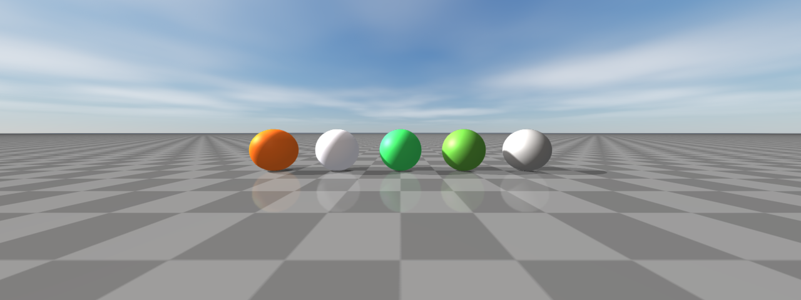

#############
PBR materials
#############

rayrai's PBR materials cover the standard metallic-roughness slots plus
extensions for clearcoat, sheen, transmission, anisotropy, subsurface,
and detail textures. The importer fills these in automatically for glTF
assets; in-process code typically constructs materials with the static
factories described below and applies them via
``Visuals::setMaterialOverride``.

Visual-level material controls (override, remap, overlay, visibility range,
shadow casting modes) are on the :doc:`Visuals` page. Tone mapping and
post-process are on :doc:`PostProcess`.

Supported PBR inputs
====================
rayrai supports a lightweight glTF-style metallic-roughness PBR path in addition to
the existing simple Phong-style renderer. Simple color and legacy textured meshes stay
on the fast path; PBR shader work is used only for meshes whose material requests PBR
features or PBR texture maps.

Supported core inputs include:

* base color factor and base color texture
* metallic and roughness factors
* metallic-roughness texture (or separate metallic + roughness textures)
* normal texture (with OpenGL or DirectX ``NormalMapConvention``)
* bent-normal texture (for higher-quality AO/indirect occlusion)
* occlusion texture
* emissive factor and emissive texture (Add or Multiply ``EmissionOperator``)

The PBR material model also exposes a wider set of authoring slots used by
imported scenes and authored assets. The full ``raisin::Material::TextureSlot``
list is: ``Albedo``, ``Normal``, ``BentNormal``, ``Metallic``, ``Roughness``,
``MetallicRoughness``, ``Ao``, ``Emissive``, ``Clearcoat`` / ``ClearcoatRoughness``
/ ``ClearcoatNormal``, ``SheenColor`` / ``SheenRoughness``, ``Transmission`` /
``Refraction`` / ``Thickness``, ``Subsurface`` / ``SubsurfaceTransmittance`` /
``Backlight``, ``Anisotropy``, ``WeatherMask``, ``Rim``, ``Height``,
``DetailMask`` / ``DetailAlbedo`` / ``DetailNormal``, ``Lightmap``, and
``TextureBlend``. Each slot has a per-material ``UvTransform`` (offset, scale,
rotation) and an authored flag, plus a per-slot ``TextureChannel`` selector for
scalar maps.

Material behavior is controlled by several enums on ``raisin::Material``:

* ``Type``: ``SIMPLE_COLOR``, ``TEXTURED``, ``PBR`` — user-facing type hint
  (the shader path is always PBR unless ``forceSimpleShading`` is set).
* ``AlphaMode``: ``Opaque``, ``Mask``, ``Hash``, ``Blend`` — glTF-style alpha
  treatment, with optional ``AlphaAntiAliasing`` (``AlphaToCoverage`` and
  ``AlphaToCoverageAndToOne``) for masked materials.
* ``BlendMode``: ``Mix``, ``Add``, ``Subtract``, ``Multiply``,
  ``PremultipliedAlpha`` — Godot-style transparent compositing.
* ``DistanceFadeMode``: ``Disabled``, ``PixelAlpha``, ``PixelDither``,
  ``ObjectDither`` — distance fade for far-away props and decals.
* ``DiffuseMode``: ``Burley``, ``Lambert``, ``LambertWrap``, ``Toon`` — direct
  diffuse BRDF.
* ``SpecularMode``: ``SchlickGgx``, ``Toon``, ``Disabled`` — direct specular
  BRDF.
* ``DetailBlendMode``: ``SoftMultiply``, ``Mix``, ``Add``, ``Subtract``,
  ``Multiply`` — detail-albedo compositing on top of the base color.
* ``CullMode``: ``Back``, ``Front``, ``Disabled`` — per-material face culling
  override.
* ``DepthState``: ``Inherit``, ``Enabled``, ``Disabled``, ``Inverted`` — opt-in
  depth-state override for decals, overlays, and inspection surfaces.
* ``StencilCompare`` / ``StencilEffectMode`` (``Disabled`` / ``Outline`` /
  ``Xray`` / ``Custom``) — stencil-driven selection overlays.
* ``TextureRepeatMode`` and ``TextureFilter`` — per-material sampler overrides
  (``Repeat`` / ``Mirror`` / ``Disabled`` and ``Nearest`` / ``Linear`` with
  optional mipmaps and anisotropy).
* ``BillboardMode``: ``Disabled``, ``Enabled``, ``FixedZ``, ``Particles`` —
  camera-facing rendering for foliage and sprites.
* ``UvLayer``: ``Uv1`` / ``Uv2`` — secondary UV channel for detail and
  lightmap textures.
* ``FoliageType``: ``None``, ``Grass``, ``LeafCard``, ``Bush``, ``Branch``,
  ``TreeTrunk``, ``Crop``, ``Vine`` — wind-deformation class used by the
  foliage-wind path.

Most of these knobs are populated automatically by the Assimp/glTF importer.
Authored materials can be constructed directly when in-process code needs a
specific shading mode; the next section covers the importer's fallback rules.

Material factories
==================
For in-process code, ``raisin::Material`` exposes static factory helpers that
set sensible defaults for the common shading variants. Prefer these over hand-
filling the data members.

(Image produced by ``doc_image_material_factories``.)

.. code-block:: cpp

    using raisin::Material;

    // PBR metallic/roughness material with no texture slots.
    auto orange = Material::pbr("orange", glm::vec4(0.95f, 0.43f, 0.12f, 1.0f),
                                /*metallic=*/0.0f, /*roughness=*/0.45f);

    // Unlit color (ignores scene lighting) — useful for HUDs and decals.
    auto hud = Material::unlitColor("hud", glm::vec4(1.0f, 1.0f, 1.0f, 0.85f));

    // Simple (non-PBR) lit color that uses the cheap mesh shader.
    auto debug = Material::simpleColor("debug", glm::vec4(0.0f, 1.0f, 0.0f, 1.0f));

    // Foliage default with two-sided lighting and wind classification.
    auto leaf = Material::foliage("leaf", Material::FoliageType::LeafCard,
                                  glm::vec4(0.32f, 0.58f, 0.21f, 1.0f));

    // Neutral ground material (mid-grey, rough, non-metallic).
    auto ground = Material::defaultGround();

A material's intended shading path is queried with ``usesPbrShading()``,
``canUseCorePbr()`` (compact core PBR shader is sufficient), and
``requiresHighFidelityPbr()`` (clearcoat, sheen, transmission, anisotropy, etc.
require the high-fidelity PBR shader). ``forceSimpleShading`` is a per-material
escape hatch to route through the cheap simple shader even when PBR fields are
set; ``RenderQualitySettings::forceSimpleMaterialShading`` is the global
equivalent for high-throughput RL renders that do not need PBR.

Lighting is based on rayrai's main light, optional additional lights, shadow maps,
HDR/image-based lighting when configured, and optional reflection probes. Color textures
are uploaded as sRGB; data maps such as normal, metallic-roughness, and AO remain
linear. Normal maps require tangent data; glTF assets usually provide it, and rayrai
generates or imports tangent data where possible. The PBR path is suitable for preview,
data generation, and asset inspection; it is not an offline path tracer.

The shipped PBR examples and tools are:

* ``rayrai_pbr_material_grid``: PBR material coverage across a primitive grid
  under matching HDR/IBL lighting.
* ``rayrai_pbr_texture_maps``: texture-slot coverage for base color, normal,
  metallic-roughness, occlusion, and emissive maps.
* ``rayrai_visual_asset_support``: authored glTF/GLB scene import with PBR
  materials, embedded lights, and reflection-probe sidecars while keeping
  visual and collision geometry separate.
* ``example_rayrai_pbr_asset_inspector``: bundled glTF PBR sample assets under
  Ultra quality settings with HDR environment lighting, SSAO, bloom, shadows,
  and screenshot output.
* ``example_polyhaven_blue_wall``: Poly Haven glTF scene import with authored
  lights, HDR IBL, optional reflection probes, shadow budgets, and screenshot
  output.
* ``rayrai_feature_showcase`` and ``rayrai_quality_comparison``: offscreen
  feature coverage and preset comparison images that exercise the PBR path,
  post-processing, lighting, and diagnostics.

Authored light sources are imported through:

* ``KHR_lights_punctual`` from the glTF/GLB file for directional, point, and
  spot lights.
* ``*.rayrai_lights.json`` for Blender area lights with size, direction,
  color, and energy.

For best results, keep the authored scene in metric scale, keep Z as up, and prefer
glTF/GLB over OBJ. OBJ is useful for simple geometry interchange, but it loses too much
of the scene-level material and light data needed for high-quality rendering.

Material import details
=======================
The Assimp/glTF importer is asset-agnostic. It does not special-case the blue-wall
scene or material names. It follows this priority:

* Use explicit material texture slots from the source asset when present.
* Treat base-color and emissive maps as color textures.
* Treat normal, metallic-roughness, occlusion, masks, and other data maps as linear data.
* Preserve normal-map scale and detect common OpenGL-vs-DirectX normal-map naming.
* Use embedded glTF textures when available.
* Search sibling texture files for common PBR map names when the source material omits
  a slot but the files are packaged next to the asset.
* Keep simple solid-color materials on the simple path unless normal maps or PBR features
  require the PBR shader.

This fallback behavior is meant to support real downloadable assets whose Blender,
glTF, FBX, DAE, and OBJ exports often disagree about how texture slots are authored.
If an asset renders white or flat, first check the import report/debug output for which
texture slots were found and whether the file paths exist next to the scene.

Visual assets and collision assets
==================================
rayrai visual meshes are renderer assets. URDF models can define separate
``visual`` and ``collision`` meshes, and standalone rayrai visuals can use glTF
material and texture data for inspection or presentation without becoming
collision geometry in ``raisim::World``. Keep this separation when an asset has
high-detail visual triangles, PBR materials, or texture maps.

Use this pattern when you want realistic visuals with collision meshes tuned for
physics:

.. code-block:: cpp

    auto* robot = world.addArticulatedSystem("anymal_c/urdf/anymal.urdf");
    auto* object = world.addArticulatedSystem("ycb/002_master_chef_can.urdf");

Only call ``World::addMesh`` for collision when the mesh is intentionally part
of the physics model. The current textured glTF and imported scene examples keep
renderer assets separate from collision geometry; the physics model still comes
from the URDF or explicit collision objects.

Subsurface scattering and backlight
***********************************
rayrai approximates subsurface scattering with three controls that combine
cheaply for plausible skin, leaves, wax, and thin plastic.

* ``viewerSubsurfaceWrap`` / ``viewerSubsurfaceTint`` wrap the diffuse falloff
  past 90 degrees and tint the wrap region (warm flesh tones by default).
  This is a global, cheap post-shading approximation.
* The ``Subsurface`` and ``SubsurfaceTransmittance`` ``Material`` texture
  slots feed a per-material thickness/transmission term. ``Material::DiffuseMode``
  ``Toon`` and ``LambertWrap`` make the wrap response artist-controllable.
* The ``Backlight`` slot drives a separate light contribution that comes from
  *behind* the surface — useful for translucent leaves, candle wax, and thin
  fabric in rim lighting.

The two showcase images contrast a wrap-only subsurface response (cheap,
shader-side) against an authored skin material that uses the dedicated SSS
texture slots and tuned wrap. The backlight image shows leaves lit from behind
the camera receiving energy through the leaf rather than just on the camera
side.

.. code-block:: cpp

    // Global wrap-light approximation — cheapest path.
    auto quality = viewer.getRenderQualitySettings();
    quality.viewerSubsurfaceWrap = 0.45f;
    quality.viewerSubsurfaceTint = glm::vec3(1.0f, 0.78f, 0.66f);  // warm flesh
    viewer.setRenderQualitySettings(quality);

    // Authored skin material driving the SSS texture slots.
    auto skin = raisin::Material::pbr(
      "skin", glm::vec4(0.96f, 0.78f, 0.68f, 1.0f),
      /*metallic=*/0.0f, /*roughness=*/0.55f);
    skin.diffuseMode = raisin::Material::DiffuseMode::LambertWrap;
    skin.subsurfaceMap = subsurfaceMapId;
    skin.subsurfaceTransmittanceMap = transmittanceMapId;

    // Translucent leaf with backlight response.
    auto leaf = raisin::Material::foliage(
      "leaf", raisin::Material::FoliageType::LeafCard,
      glm::vec4(0.32f, 0.58f, 0.21f, 1.0f));
    leaf.backlightMap = leafBacklightMapId;
    leaf.cullMode = raisin::Material::CullMode::Disabled;  // two-sided

.. list-table::
   :header-rows: 1
   :widths: 50 50

   * - viewerSubsurfaceWrap
     - Authored skin (SSS slots)
   * - .. image:: ../../image/rayrai/showcase/66_subsurface_wrap.png
          :alt: Wrap-light approximation
     - .. image:: ../../image/rayrai/showcase/116_material_subsurface_skin.png
          :alt: Subsurface skin material with thickness map
   * - Backlight slot
     -
   * - .. image:: ../../image/rayrai/showcase/100_material_sss_backlight.png
          :alt: Backlight slot adding from-behind translucency
     -

Bloom, HDR, and PBR
*******************
Bloom (``bloomEnabled``) uses a Gaussian-pyramid down/upsample with knee
threshold (``bloomThreshold``, ``bloomKnee``), strength, source clamp, and
optional anamorphic squeeze. The ``bloomDirtTexture`` slot multiplies bloom
by a lens-dirt mask for a stylized lens look. Emissive surfaces with
intensities above the threshold bloom naturally.

HDR / IBL setup loads a single equirectangular HDR file and integrates the
diffuse irradiance + GGX-prefiltered specular cubemaps plus the split-sum
BRDF lookup. Reflective surfaces sample these instead of a constant ambient
term, which is what makes metals look like metals.

PBR materials with full texture coverage (base colour, normal,
metallic-roughness, AO, emissive, plus the extension slots) are illustrated by
the ``07_pbr_material_maps`` reference image; an authored Poly Haven scene is
included for context.

.. code-block:: cpp

    // Bloom on emissive surfaces above threshold + optional lens-dirt mask.
    auto quality = viewer.getRenderQualitySettings();
    quality.bloomEnabled = true;
    quality.bloomThreshold = 1.20f;        // HDR luminance threshold
    quality.bloomStrength = 0.28f;
    quality.bloomRadius = 4.0f;
    quality.bloomKnee = 0.22f;
    quality.bloomQuality = 1;              // 0=fast, 1=high
    quality.bloomDirtTexture = lensDirtTextureId;  // optional
    quality.bloomDirtStrength = 0.35f;
    viewer.setRenderQualitySettings(quality);

    // HDR / IBL on a single visual.
    auto env = raisin::PbrEnvironment::loadFromHdrFile("/path/studio.hdr");
    metalSphere->setPbrEnvironment(env);

    // Author a fully-textured PBR material for an imported asset.
    auto floor = raisin::Material::pbr("hardwood",
                                       glm::vec4(0.42f, 0.27f, 0.18f, 1.0f),
                                       /*metallic=*/0.0f, /*roughness=*/0.42f);
    floor.albedoMap = hardwoodAlbedoMapId;
    floor.normalMap = hardwoodNormalMapId;
    floor.metallicRoughnessMap = hardwoodMetallicRoughnessMapId;
    floor.aoMap = hardwoodAoMapId;
    floor.emissiveMap = 0;                 // unused
    floorVisual->setMaterialOverride(floor);

.. list-table::
   :header-rows: 1
   :widths: 50 50

   * - HDR / IBL
     - PBR material maps
   * - .. image:: ../../image/rayrai/showcase/08_hdr_ibl.png
          :alt: HDR environment driving IBL on metallic surfaces
     - .. image:: ../../image/rayrai/showcase/07_pbr_material_maps.png
          :alt: Spheres with progressive PBR map coverage
   * - Bloom (emissive)
     - Bloom with dirt mask
   * - .. image:: ../../image/rayrai/showcase/14_bloom_emissive.png
          :alt: Emissive surfaces blooming above threshold
     - .. image:: ../../image/rayrai/showcase/47_bloom_dirt_mask.png
          :alt: Bloom modulated by a lens-dirt texture
   * - Material extensions
     - Authored scene (Poly Haven Blue Wall)
   * - .. image:: ../../image/rayrai/showcase/15_material_extensions.png
          :alt: Clearcoat, sheen, anisotropy slots
     - .. image:: ../../image/rayrai/showcase/09_blue_wall_scene.png
          :alt: Authored Poly Haven blue wall scene

