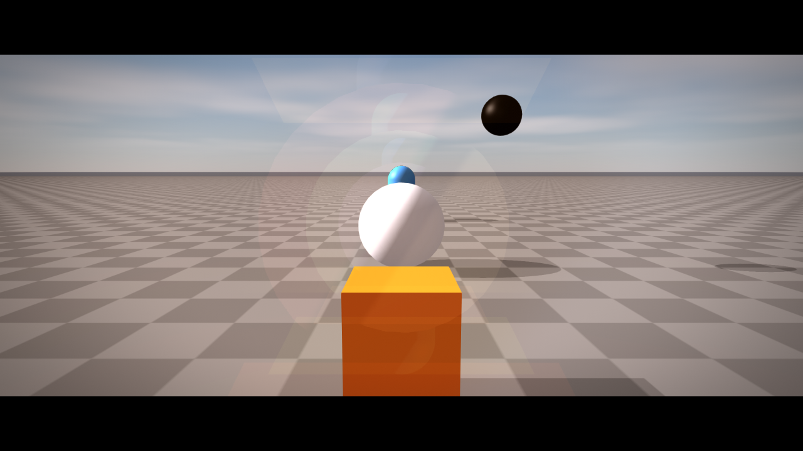
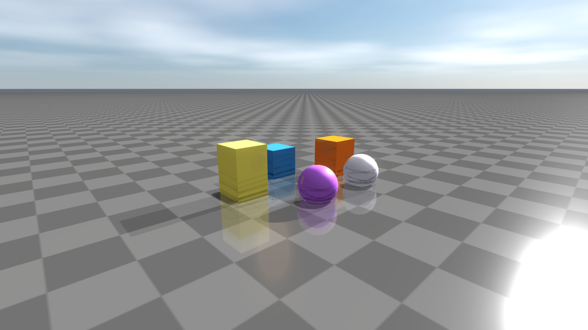

####################
Post-process effects
####################

This page covers cinematic and screen-space effects driven by
``RenderQualitySettings`` — DoF, lens flares, vignette, motion blur, SSR,
SSAO, SSIL, contact shadows, refraction, and stylized looks plus the debug
visualisation passes. ``WeatherSettings`` overrides atmospheric state (fog,
wetness, sky) and is documented in :doc:`Weather`. Bloom, HDR/IBL, and PBR
materials live in :doc:`Materials` and :doc:`Lighting`.

Cinematic post-process effects
==============================
``RenderQualitySettings`` exposes a large set of optional screen-space effects.
Each one is gated by an ``*Enabled`` flag so the fast frame path stays cheap;
turn them on per-shot for screenshots, asset inspection, or demo captures.

Cinematic lens and image effects:

* ``viewerVignetteStrength`` — radial darkening.
* ``viewerChromaticAberrationStrength`` — RGB channel offset.
* ``viewerFilmGrainStrength`` — luma-noise overlay.
* ``lensFlareGhostStrength``, ``lensFlareStreakStrength``, ``lensFlareTint`` —
  cinematic lens flares around bright lights.
* ``lensDistortionEnabled`` / ``lensDistortionStrength`` /
  ``lensDistortionCenter`` — signed barrel or pincushion distortion.
* ``letterboxEnabled`` / ``letterboxAspect`` / ``letterboxColor`` —
  cinematic letterboxing.
* ``starburstEnabled`` / ``starburstStrength`` / ``starburstSpikes`` /
  ``starburstAngleOffset`` / ``starburstRadius`` / ``starburstTint`` —
  aperture-shaped highlights.
* ``zoomBlurEnabled`` / ``zoomBlurStrength`` / ``zoomBlurCenter`` /
  ``zoomBlurInnerRadius`` — radial focus blur for sprint and dash effects.
* ``motionBlurEnabled`` / ``motionBlurDirection`` / ``motionBlurStrength`` —
  directional motion blur.
* ``depthOfFieldEnabled`` / ``depthOfFieldFocusDistance`` /
  ``depthOfFieldFocusRange`` / ``depthOfFieldMaxRadius``.

Stylized and diagnostic looks:

* ``pixelateEnabled`` / ``pixelateBlockSize`` — retro pixelation.
* ``posterizeEnabled`` / ``posterizeLevels`` — color quantization.
* ``scanlineEnabled`` / ``scanlineStrength`` / ``scanlineFrequency`` —
  CRT-style scanlines.
* ``nightVisionEnabled`` / ``nightVisionStrength`` / ``nightVisionGain`` —
  monochrome green amplification.
* ``thermalEnabled`` / ``thermalStrength`` / ``thermalGain`` — heatmap LUT.
* ``ditherEnabled`` / ``ditherStrength`` — banding-control dither.

Atmospheric and water effects:

* ``underwaterEnabled`` / ``underwaterTint`` / ``underwaterCausticStrength`` /
  ``underwaterCausticScale`` / ``underwaterDepthExtinction``.
* ``heatHazeEnabled`` / ``heatHazeStrength`` / ``heatHazeFrequency`` /
  ``heatHazeSpeed`` / ``heatHazeMaxY``.
* ``lightShaftsEnabled`` / ``lightShaftsStrength`` / ``lightShaftsDecay`` /
  ``lightShaftsDensity`` — god rays from the main light.

Screen-space reflections and refraction:

* ``ssrEnabled``, ``ssrStrength``, ``ssrSteps``, ``ssrMaxDistance``,
  ``ssrThickness`` — depth-only screen-space reflections.
* ``screenSpaceRefraction``, ``screenSpaceRefractionStrength``,
  ``screenSpaceRefractionMaxPixels`` — IOR-aware refraction for transparent
  meshes.

Indirect lighting and contact effects:

* ``screenSpaceAoEnabled``, ``screenSpaceAoRadius``, ``screenSpaceAoStrength``,
  ``screenSpaceAoBias``, ``screenSpaceAoSamples``, ``screenSpaceAoFalloff``,
  ``screenSpaceAoRadiusWorldSpace``, ``screenSpaceAoMaxPixelRadius``,
  ``screenSpaceAoGeometryAware`` — SSAO controls.
* ``screenSpaceAoDenoiseEnabled``, ``screenSpaceAoDenoiseStrength``,
  ``screenSpaceAoDenoiseRadius``, ``screenSpaceAoDenoiseDepthSigma`` —
  geometry-aware AO denoise.
* ``contactShadowsEnabled``, ``contactShadowsLength``, ``contactShadowsStrength``,
  ``contactShadowsThickness`` — short-range raymarched contact shadows.
* ``contactAoRadius`` / ``contactAoStrength`` / ``contactAoSamples`` /
  ``contactAoFalloff`` — tight contact AO on top of SSAO.
* ``screenSpaceIndirectLightingEnabled`` and friends
  (``screenSpaceIndirectLightingRadius``, ``Strength``, ``Samples``,
  ``Falloff``, ``NormalRejection``, ``Saturation``) — single-bounce SSIL.

Specular AA, aerial perspective, and detail normals:

* ``specularAntiAliasing`` / ``specularAntiAliasingStrength`` — geometry-aware
  specular filtering on high-frequency surfaces.
* ``aerialPerspectiveEnabled`` / ``aerialPerspectiveStrength`` — distance-based
  atmospheric tinting driven by the sky LUTs.
* ``detailNormalEnabled`` / ``detailNormalScale`` / ``detailNormalStrength`` —
  high-frequency normal detail for close-up shots.
* ``viewerSubsurfaceWrap`` / ``viewerSubsurfaceTint`` — wrap-light approximation
  for soft subsurface response on skin and foliage.

Bloom controls (``bloomEnabled``, ``bloomThreshold``, ``bloomStrength``,
``bloomRadius``, ``bloomKnee``, ``bloomQuality``, ``bloomSourceClamp``,
``bloomAnamorphic``, ``bloomDirtStrength``, ``bloomDirtScale``,
``bloomDirtTexture``, ``bloomMix``) cover both clean and lens-dirt looks.

Diagnostics: ``PostProcessDebugMode`` (``Final``, ``BloomSource``,
``AmbientOcclusion``, ``AmbientOcclusionRaw``, ``FogTransmittance``,
``FogDensity``, ``FogScattering``, ``WorldNormal``, ``DepthHeatmap``,
``ScreenSpaceIndirectLighting``) routes a debug pass to the final image so the
underlying buffers can be inspected without leaving the normal render path.

A full cinematic frame typically enables several of these together. The
snippet below pairs bloom + DoF + vignette + chromatic aberration + film
grain + lens flare + a slight letterbox for a film-shot look:

.. code-block:: cpp

    auto quality = raisin::RayraiWindow::defaultRenderQualitySettings(
      raisin::RayraiWindow::RenderQualityPreset::Ultra);

    quality.colorMode = raisin::ViewerColorMode::AcesApprox;
    quality.pbrToneMapping = true;
    quality.viewerColorGradePreset = raisin::ColorGradePreset::Cinematic;

    quality.bloomEnabled = true;
    quality.bloomThreshold = 1.10f;
    quality.bloomStrength = 0.22f;

    quality.depthOfFieldEnabled = true;
    quality.depthOfFieldFocusDistance = 5.0f;
    quality.depthOfFieldFocusRange = 1.5f;
    quality.depthOfFieldMaxRadius = 1.4f;

    quality.viewerVignetteStrength = 0.40f;
    quality.viewerChromaticAberrationStrength = 0.08f;
    quality.viewerFilmGrainStrength = 0.05f;

    quality.lensFlareGhostStrength = 0.45f;
    quality.lensFlareStreakStrength = 0.30f;
    quality.lensFlareTint = glm::vec3(0.55f, 0.78f, 1.10f);

    quality.letterboxEnabled = true;
    quality.letterboxAspect = 2.35f;

    viewer.setRenderQualitySettings(quality);

For inspection, route a debug mode to the final image:

.. code-block:: cpp

    auto q = viewer.getRenderQualitySettings();
    q.postProcessDebugMode = raisin::PostProcessDebugMode::AmbientOcclusion;
    viewer.setRenderQualitySettings(q);

Screen-space reflections, AO, and indirect lighting
***************************************************
Screen-space reflections (``ssrEnabled``) march the depth buffer along each
reflected ray and sample the colour buffer at the first hit. The result is a
cheap, depth-only approximation that captures puddle reflections, glossy
floors, and glass-like mirror surfaces without authoring a reflection probe.
Tune the trade-off with ``ssrStrength``, ``ssrSteps``, ``ssrMaxDistance``, and
``ssrThickness``.

Screen-space ambient occlusion (``screenSpaceAoEnabled``) darkens crevices,
corners, and tight contacts using ``screenSpaceAoRadius`` (with
``screenSpaceAoRadiusWorldSpace`` to switch from pixel to metres),
``screenSpaceAoSamples``, ``screenSpaceAoFalloff``, and
``screenSpaceAoStrength``. The denoise pass
(``screenSpaceAoDenoiseEnabled``) is geometry-aware and preserves edges.
``contactAoRadius`` / ``contactAoStrength`` add a separate tight contact-AO
pass on top of SSAO for surfaces that touch.

Screen-space indirect lighting (``screenSpaceIndirectLightingEnabled``)
bounces one indirect ray per pixel against the colour buffer to add coloured
fill light from nearby diffuse surfaces; ``Radius``, ``Strength``, ``Samples``,
``Falloff``, ``NormalRejection``, and ``Saturation`` control quality and bias.

Contact shadows (``contactShadowsEnabled``) ray-march short shadow rays in
screen space to recover fine occlusion near grazing geometry that a shadow
map misses; ``Length``, ``Strength``, and ``Thickness`` are in metres.

.. code-block:: cpp

    auto quality = raisin::RayraiWindow::defaultRenderQualitySettings(
      raisin::RayraiWindow::RenderQualityPreset::High);

    // Screen-space reflections.
    quality.ssrEnabled = true;
    quality.ssrStrength = 0.85f;
    quality.ssrSteps = 32;
    quality.ssrMaxDistance = 8.0f;
    quality.ssrThickness = 0.35f;

    // SSAO with denoise.
    quality.screenSpaceAoEnabled = true;
    quality.screenSpaceAoRadius = 1.5f;
    quality.screenSpaceAoStrength = 0.65f;
    quality.screenSpaceAoSamples = 16;
    quality.screenSpaceAoRadiusWorldSpace = true;  // radius is metres
    quality.screenSpaceAoDenoiseEnabled = true;
    quality.screenSpaceAoDenoiseStrength = 0.75f;

    // Tight contact AO on top of SSAO.
    quality.contactAoRadius = 0.04f;
    quality.contactAoStrength = 0.55f;

    // Single-bounce screen-space indirect lighting.
    quality.screenSpaceIndirectLightingEnabled = true;
    quality.screenSpaceIndirectLightingStrength = 0.45f;
    quality.screenSpaceIndirectLightingSamples = 12;

    // Short raymarched contact shadows that recover fine creases.
    quality.contactShadowsEnabled = true;
    quality.contactShadowsLength = 0.18f;
    quality.contactShadowsStrength = 0.7f;
    quality.contactShadowsThickness = 0.06f;

    viewer.setRenderQualitySettings(quality);

.. list-table::
   :header-rows: 1
   :widths: 50 50

   * - Screen-space reflections (SSR)
     - Screen-space indirect lighting (SSIL)
   * - .. image:: ../../image/rayrai/showcase/72_ssr.png
          :alt: SSR on glossy floor and puddles
     - .. image:: ../../image/rayrai/showcase/71_screen_space_indirect_lighting.png
          :alt: SSIL adds coloured bounce light
   * - Contact shadows
     - Screen-space refraction
   * - .. image:: ../../image/rayrai/showcase/69_contact_shadows.png
          :alt: Short-range raymarched contact shadows
     - .. image:: ../../image/rayrai/showcase/21_screen_space_refraction.png
          :alt: IOR-driven refraction

Depth of field, lens flares, and lens character
***********************************************
Depth of field (``depthOfFieldEnabled``, ``depthOfFieldFocusDistance``,
``depthOfFieldFocusRange``, ``depthOfFieldMaxRadius``) uses a hex-bokeh disk
and a depth-driven circle-of-confusion sample. The hex shape is intentionally
cinematic; ``starburstEnabled`` adds an aperture-shaped highlight starburst
for in-focus bright sources.

Lens flare uses two layers: ghost reflections projected toward the screen
centre (``lensFlareGhostStrength``) and an axial streak from very bright
sources (``lensFlareStreakStrength``). Both share ``lensFlareTint`` (a cool
cinematic blue by default).

``viewerVignetteStrength``, ``viewerChromaticAberrationStrength``, and
``viewerFilmGrainStrength`` add the rest of the standard photographic camera
character. ``lensDistortionEnabled`` applies signed barrel / pincushion
distortion centred at ``lensDistortionCenter``.

.. code-block:: cpp

    auto quality = viewer.getRenderQualitySettings();

    // Depth of field with cinematic hex bokeh.
    quality.depthOfFieldEnabled = true;
    quality.depthOfFieldFocusDistance = 4.5f;   // metres
    quality.depthOfFieldFocusRange = 1.8f;      // metres of in-focus band
    quality.depthOfFieldMaxRadius = 1.6f;       // pixels at far blur

    // Aperture-shaped highlight starburst.
    quality.starburstEnabled = true;
    quality.starburstStrength = 0.6f;
    quality.starburstSpikes = 6;

    // Lens flare (ghosts and axial streak).
    quality.lensFlareGhostStrength = 0.55f;
    quality.lensFlareStreakStrength = 0.35f;
    quality.lensFlareTint = glm::vec3(0.62f, 0.78f, 1.10f);  // cool cinematic

    // Camera character.
    quality.viewerVignetteStrength = 0.35f;
    quality.viewerChromaticAberrationStrength = 0.08f;
    quality.viewerFilmGrainStrength = 0.04f;

    // Optional barrel distortion.
    quality.lensDistortionEnabled = true;
    quality.lensDistortionStrength = 0.12f;     // > 0 = barrel, < 0 = pincushion

    viewer.setRenderQualitySettings(quality);

.. list-table::
   :header-rows: 1
   :widths: 50 50

   * - Depth of field
     - Hex bokeh detail
   * - .. image:: ../../image/rayrai/showcase/02_depth_of_field.png
          :alt: Focus distance with depth-of-field blur
     - .. image:: ../../image/rayrai/showcase/68_hex_bokeh.png
          :alt: Hex aperture bokeh on highlights
   * - Lens flare
     - Lens character (vignette + grain + CA)
   * - .. image:: ../../image/rayrai/showcase/67_lens_flare.png
          :alt: Lens flare ghost and streak
     - .. image:: ../../image/rayrai/showcase/63_lens_character.png
          :alt: Vignette + chromatic aberration + film grain

Motion blur and atmospheric effects
***********************************
Directional motion blur (``motionBlurEnabled``, ``motionBlurDirection``,
``motionBlurStrength``) smears the colour buffer along a constant screen-space
vector. Useful for shutter-style captures and stylized motion frames.

Heat haze (``heatHazeEnabled``) perturbs UVs with a noise field above
``heatHazeMaxY`` in screen space, simulating hot air shimmer. Underwater
(``underwaterEnabled``, ``underwaterTint``, ``underwaterCausticStrength``,
``underwaterCausticScale``, ``underwaterDepthExtinction``) tints the image,
adds animated caustic patterns, and attenuates by depth.

.. code-block:: cpp

    auto q = viewer.getRenderQualitySettings();

    // Directional motion blur — typical "running camera" look.
    q.motionBlurEnabled = true;
    q.motionBlurDirection = glm::vec2(1.0f, 0.0f);  // horizontal sweep
    q.motionBlurStrength = 0.45f;

    // Hot tarmac shimmer above the horizon line.
    q.heatHazeEnabled = true;
    q.heatHazeStrength = 0.30f;
    q.heatHazeFrequency = 5.0f;
    q.heatHazeSpeed = 1.2f;
    q.heatHazeMaxY = 0.60f;

    // Underwater scene.
    q.underwaterEnabled = true;
    q.underwaterTint = glm::vec3(0.20f, 0.55f, 0.85f);
    q.underwaterCausticStrength = 0.6f;
    q.underwaterCausticScale = 1.0f;
    q.underwaterDepthExtinction = 1.2f;

    // High-frequency detail normals on every PBR surface.
    q.detailNormalEnabled = true;
    q.detailNormalScale = 30.0f;    // cycles per metre
    q.detailNormalStrength = 0.18f;

    viewer.setRenderQualitySettings(q);

.. list-table::
   :header-rows: 1
   :widths: 50 50

   * - Motion blur
     - Heat haze
   * - .. image:: ../../image/rayrai/showcase/70_motion_blur.png
          :alt: Directional motion blur
     - .. image:: ../../image/rayrai/showcase/73_heat_haze.png
          :alt: Heat haze UV displacement
   * - Underwater
     - Detail normals
   * - .. image:: ../../image/rayrai/showcase/78_underwater.png
          :alt: Underwater tint, caustics, extinction
     - .. image:: ../../image/rayrai/showcase/64_detail_normal.png
          :alt: High-frequency detail normal layer

Stylized and diagnostic looks
*****************************
The stylized post-process effects on ``RenderQualitySettings`` are useful for
authoring previews and for inspection of specific buffers without leaving the
normal render path. Thermal and night vision are typical operator-camera
looks; the calibration reference is intended to drive
``analyzeRgbaCalibrationPatches`` for capture-pipeline tuning.

.. code-block:: cpp

    auto q = viewer.getRenderQualitySettings();

    // Thermal LUT (monochrome heat-map).
    q.thermalEnabled = true;
    q.thermalStrength = 1.0f;
    q.thermalGain = 1.5f;

    // Night vision (green amplification with noise).
    q.nightVisionEnabled = true;
    q.nightVisionStrength = 1.0f;
    q.nightVisionGain = 2.5f;

    // CRT scanlines + posterize + lens distortion for an arcade look.
    q.scanlineEnabled = true;
    q.scanlineStrength = 0.35f;
    q.scanlineFrequency = 480.0f;
    q.posterizeEnabled = true;
    q.posterizeLevels = 6;
    q.lensDistortionEnabled = true;
    q.lensDistortionStrength = -0.12f;  // pincushion

    viewer.setRenderQualitySettings(q);

    // Pick one debug pass at a time for inspection.
    auto debug = viewer.getRenderQualitySettings();
    debug.postProcessDebugMode = raisin::PostProcessDebugMode::DepthHeatmap;
    viewer.setRenderQualitySettings(debug);

.. list-table::
   :header-rows: 1
   :widths: 50 50

   * - Thermal
     - Night vision
   * - .. image:: ../../image/rayrai/showcase/84_thermal.png
          :alt: Thermal LUT
     - .. image:: ../../image/rayrai/showcase/80_night_vision.png
          :alt: Night vision gain
   * - Auto exposure
     - Calibration reference
   * - .. image:: ../../image/rayrai/showcase/62_auto_exposure.png
          :alt: Auto exposure key/speed driving the loop
     - .. image:: ../../image/rayrai/showcase/48_calibration_reference.png
          :alt: Calibration patches for output transform tuning

