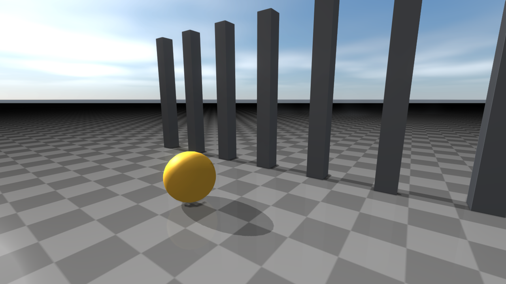
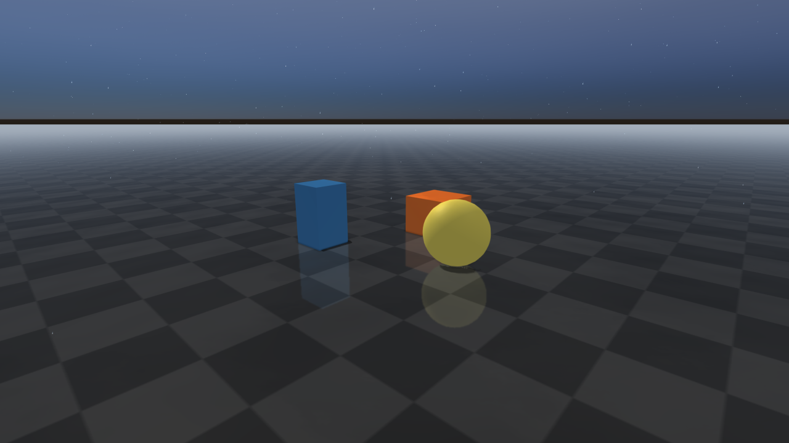

########################
Weather and atmospherics
########################

Weather is preset-driven and exposes both renderer-side state
(``RenderQualitySettings``) and runtime atmospheric overrides
(``WeatherSettings``). When ``WeatherSettings::enabled = true`` the
atmospheric fields on ``WeatherSettings`` override the matching
``RenderQualitySettings`` fields for that frame.

Weather presets
===============
Presets cover ``Clear``, ``Hazy``, ``Overcast``, ``Fog``, ``Rain``,
``HeavyRain``, ``Snow``, ``Storm``, ``NightClear``, ``NightRain``, and
``Custom``. Quality steps (``Low``, ``Medium``, ``High``, ``Ultra``) trade
fidelity against particle and texture budgets.

``WeatherSettings`` and ``RenderQualitySettings`` overlap on atmospheric
fields (fog density, wetness, volumetric fog, sky tinting). The precedence
rule is: when ``WeatherSettings::enabled = true``, the renderer reads
weather fields and ignores the corresponding ``RenderQualitySettings``
fields for that frame. When ``enabled = false``, ``RenderQualitySettings``
applies. Numeric units in ``WeatherSettings``: ``timeOfDayHours`` in hours
``[0, 24)``, ``latitude`` / ``longitude`` in degrees, ``windSpeed`` in m/s,
``visibilityMeters`` / ``radius`` / distance-fade fields in metres,
``fogDensity`` in metres⁻¹ (exponential extinction), ``fogAnisotropy`` is
the Henyey-Greenstein ``g`` in ``[-1, 1]``, ``cloudCoverage`` /
``cloudDensity`` / ``rainOcclusionStrength`` / ``humidity`` / ``wetness``
normalized in ``[0, 1]``, and ``wetnessAccumulationRate`` /
``wetnessDryingRate`` per second.

.. list-table::
   :header-rows: 1
   :widths: 50 50

   * - Clear
     - Overcast
   * - .. image:: ../../image/rayrai/rayrai_weather_clear.png
          :alt: Clear weather preset
     - .. image:: ../../image/rayrai/rayrai_weather_overcast.png
          :alt: Overcast weather preset
   * - Rain
     - Snow
   * - .. image:: ../../image/rayrai/rayrai_weather_rain.png
          :alt: Rain weather preset
     - .. image:: ../../image/rayrai/rayrai_weather_snow.png
          :alt: Snow weather preset
   * - Storm
     - NightClear
   * - .. image:: ../../image/rayrai/rayrai_weather_storm.png
          :alt: Storm weather preset
     - .. image:: ../../image/rayrai/rayrai_weather_night_clear.png
          :alt: NightClear weather preset

The grid is produced by ``doc_image_weather_presets`` in
``docs/image_generators/``.

Start from ``RayraiWindow::defaultWeatherSettings``, apply it with
``setWeatherSettings`` or ``setWeatherPreset``, and call ``updateWeather``
from your frame loop when the weather state should animate.
``transitionWeather`` blends between presets or settings over a duration;
``weatherDiagnostics`` reports the resolved sun/moon, fog, precipitation,
wetness, snow, lightning, lens-droplet, and generated sky state.
``setWeatherThunderCallback`` fires when lightning produces a thunder event
so the application can play audio or trigger gameplay reactions.

.. code-block:: cpp

    auto weather = raisin::RayraiWindow::defaultWeatherSettings(
      raisin::RayraiWindow::WeatherPreset::Rain);
    weather.enabled = true;
    weather.affectSensors = false;
    weather.timeOfDayHours = 17.5f;
    weather.windSpeed = 3.0f;
    weather.lensDropletsEnabled = true;
    viewer.setWeatherSettings(weather);

    viewer.setWeatherThunderCallback( {
      // play audio at event.delaySeconds with event.intensity, etc.
    });

    // Frame loop animation.
    viewer.updateWeather(dt);
    auto diagnostics = viewer.weatherDiagnostics();
    if (diagnostics.lightningActive) {
      // react to the current flash
    }

    // Smooth blend to a new preset over four seconds.
    viewer.transitionWeather(raisin::RayraiWindow::WeatherPreset::Storm, 4.0);

For local effects, use ``addLocalFogVolume`` / ``clearLocalFogVolumes``,
``addProjectedDecal`` / ``clearProjectedDecals``, and
``addIrradianceVolume`` / ``clearIrradianceVolumes``. Each list is capped
(eight local fog volumes, eight projected decals, eight irradiance volumes)
so the fast frame path stays predictable. Weather-driven sky maps are
created on demand with
``generateWeatherSkyEnvironment(envFaceSize, irradianceFaceSize,
setAsBackground)``; do this at transition points or setup time, not every
frame. ``clearWeatherSkyEnvironment`` releases the cubemaps.

.. code-block:: cpp

    raisin::LocalFogVolume cloud;
    cloud.center = glm::vec3(0.0f, 2.0f, 1.2f);
    cloud.radius = 3.0f;
    cloud.density = 0.18f;
    cloud.edgeFade = 0.45f;
    viewer.addLocalFogVolume(cloud);

    raisin::ProjectedDecal puddle;
    puddle.center = glm::vec3(1.5f, -0.8f, 0.01f);
    puddle.halfExtents = glm::vec3(0.8f, 0.8f, 0.05f);
    puddle.color = glm::vec4(0.0f, 0.0f, 0.0f, 0.8f);
    viewer.addProjectedDecal(puddle);

    raisin::IrradianceVolume ambient;
    ambient.center = glm::vec3(0.0f, 0.0f, 1.5f);
    ambient.halfExtents = glm::vec3(4.0f, 4.0f, 2.0f);
    ambient.color = glm::vec3(0.20f, 0.22f, 0.30f);
    ambient.strength = 0.8f;
    viewer.addIrradianceVolume(ambient);

Enabling the procedural sky and sky IBL
=======================================
The procedural sky is **on by default** in rayrai. The struct-default for
``RenderQualitySettings::proceduralSkyBackgroundEnabled`` is ``true``, so
every preset (Fast / Balanced / High / Ultra) renders the analytic
Hillaire sky as the background out of the box. You do not need to do
anything to turn it on; you only need to call the helpers below if you
want it to *light* the scene as ambient.

Two-step recipe to get a sky that also drives shaded-side ambient:

.. code-block:: cpp

    raisin::RayraiWindow viewer(world, 1280, 720);

    // 1) Pick a preset. Procedural sky is already enabled by every
    //    built-in preset, so no flag flip is needed.
    viewer.setRenderQualityPreset(
        raisin::RayraiWindow::RenderQualityPreset::High);

    // 2) Bake the procedural sky into a real IBL environment cubemap +
    //    irradiance cubemap so PBR materials sample sky colour for
    //    indirect lighting. Without this call the sky is "background
    //    only" — PBR surfaces see no environment contribution.
    viewer.generateWeatherSkyEnvironment(
        /*envFaceSize=*/128,
        /*irradianceFaceSize=*/32,
        /*setAsBackground=*/true);

After that, ``RenderQualitySettings::pbrEnvironmentIntensity`` controls
how strong the IBL contribution is. The preset defaults are tuned for
outdoor daylight; lower it for an overcast or indoor feel.

If you want to **turn the sky off** (for a flat colour background or to
use an HDR environment instead):

.. code-block:: cpp

    auto q = viewer.getRenderQualitySettings();
    q.proceduralSkyBackgroundEnabled = false;
    q.proceduralCloudLayerEnabled = false;
    viewer.setRenderQualitySettings(q);
    viewer.setBackgroundColorRgb255({20, 22, 32, 255});  // flat fallback

To swap in your own HDR environment (the
:doc:`PbrEnvironment <Lighting>` bundle), load the HDR file, set it as
the background, and the PBR shader will use it instead of the procedural
sky:

.. code-block:: cpp

    auto env = raisin::PbrEnvironment::loadFromHdrFile("/path/studio.hdr");
    viewer.setEnvironmentBackground(env.environmentCubemap, /*exposure=*/1.0f);

The procedural sky is cheap (a few small LUTs); the IBL bake is a
one-time cost when the renderer initialises or when weather state
changes substantially. Both are documented in more detail below.

Volumetric fog, sky, and light shafts
=====================================
On top of the standard exponential fog (``fogDensity``,
``fogColorOverrideEnabled``, ``fogColor``), the renderer supports height fog
(``heightFogEnabled``, ``heightFogDensity``, ``heightFogBaseHeight``,
``heightFogFalloff``) and a volumetric fog volume
(``volumetricFogEnabled``, ``volumetricFogDensity``,
``volumetricFogNoiseScale``, ``volumetricFogNoiseStrength``,
``volumetricFogColor``, ``volumetricFogAnisotropy``,
``volumetricFogAnimationTimeSeconds``, ``volumetricFogWindDirection``,
``volumetricFogWindSpeed``, ``volumetricFogTurbulenceSpeed``).
Volumetric lighting (``volumetricLightingEnabled``,
``volumetricLightStrength``, ``volumetricLightDecay``,
``volumetricLightSamples``) scatters the main light through the fog volume.

The procedural sky path uses an analytic Hillaire-style atmosphere LUT with
multi-scatter and aerial-perspective passes. Enable it with
``proceduralSkyBackgroundEnabled`` and tune sun visibility
(``proceduralSkySunStrength``, ``proceduralSkySunSize``). A separate
procedural cloud layer adds ``proceduralCloudLayerEnabled``,
``proceduralCloudCoverage``, ``proceduralCloudDensity``,
``proceduralCloudScale``, ``proceduralCloudSoftness``,
``proceduralCloudOffset``, ``proceduralCloudTint``; cloud shadows
(``cloudShadowProjectionEnabled``, ``cloudShadowStrength``,
``cloudShadowScale``) project that layer back onto the scene.

.. code-block:: cpp

    auto quality = viewer.getRenderQualitySettings();

    // Height fog on top of the standard exponential fog.
    quality.fogDensity = 0.015f;
    quality.heightFogEnabled = true;
    quality.heightFogDensity = 0.04f;
    quality.heightFogBaseHeight = 0.0f;
    quality.heightFogFalloff = 0.35f;

    // Animated volumetric fog with subtle wind.
    quality.volumetricFogEnabled = true;
    quality.volumetricFogDensity = 0.018f;
    quality.volumetricFogColor = glm::vec3(0.74f, 0.82f, 0.92f);
    quality.volumetricFogAnisotropy = 0.30f;
    quality.volumetricFogWindDirection = glm::vec2(1.0f, 0.0f);
    quality.volumetricFogWindSpeed = 0.6f;
    quality.volumetricFogAnimationTimeSeconds = currentTimeSeconds;

    // Light shafts from the main directional light.
    quality.volumetricLightingEnabled = true;
    quality.volumetricLightStrength = 0.6f;
    quality.volumetricLightDecay = 0.94f;
    quality.volumetricLightSamples = 32;
    quality.lightShaftsEnabled = true;
    quality.lightShaftsStrength = 0.8f;

    // Procedural sky + clouds.
    quality.proceduralSkyBackgroundEnabled = true;
    quality.proceduralSkySunStrength = 1.4f;
    quality.proceduralCloudLayerEnabled = true;
    quality.proceduralCloudCoverage = 0.55f;
    quality.cloudShadowProjectionEnabled = true;
    quality.cloudShadowStrength = 0.35f;

    viewer.setRenderQualitySettings(quality);

.. list-table::
   :header-rows: 1
   :widths: 50 50

   * - Sky and height fog
     - Volumetric fog + light shafts
   * - .. image:: ../../image/rayrai/showcase/13_sky_height_fog.png
          :alt: Procedural sky with height fog
     - .. image:: ../../image/rayrai/showcase/16_volumetric_fog_lighting.png
          :alt: Volumetric fog and scattering
   * - Cloud shadows
     - Aerial perspective
   * - .. image:: ../../image/rayrai/showcase/28_weather_cloud_shadows.png
          :alt: Procedural cloud shadow projection
     - .. image:: ../../image/rayrai/showcase/60_aerial_perspective.png
          :alt: Distance-based atmospheric tinting
   * - Local fog volumes
     - Light shafts (god rays)
   * - .. image:: ../../image/rayrai/showcase/29_weather_fog_local_volumes.png
          :alt: Spherical local fog volumes
     - .. image:: ../../image/rayrai/showcase/65_light_shafts.png
          :alt: Screen-space light shafts

Foliage wind
============
Authored foliage and instanced grass deform under a global wind field when
``foliageWindEnabled`` is set. ``foliageWindDirection`` and
``foliageWindSpeed`` drive the base motion; ``foliageWindTimeSeconds`` is
the wind clock the application drives from its frame loop.
``foliageWindGustStrength`` and ``foliageWindGustScale`` add slower gust
noise on top, while ``foliageWindBranchBend`` controls coarse trunk/branch
bend and ``foliageWindLeafFlutter`` controls fine leaf flutter. The
per-mesh response amplitude comes from the material's ``FoliageType`` and
the vertex color channels populated by the importer.

Foliage uses two-sided lighting and weather-driven leaf colour shifts.
Grass patches and dense bushes are usually rendered through
``InstancedVisuals`` so thousands of blades share one upload, with
per-instance scale and rotation driving subtle variation.

.. code-block:: cpp

    auto quality = viewer.getRenderQualitySettings();
    quality.foliageWindEnabled = true;
    quality.foliageWindDirection = glm::vec2(0.7f, 0.7f);  // diagonal wind
    quality.foliageWindSpeed = 2.4f;                       // base m/s
    quality.foliageWindTimeSeconds = currentTimeSeconds;   // animation clock
    quality.foliageWindGustStrength = 0.6f;                // gust amplitude
    quality.foliageWindGustScale = 1.2f;                   // gust spatial scale
    quality.foliageWindBranchBend = 0.22f;                 // coarse trunk bend
    quality.foliageWindLeafFlutter = 0.10f;                // fine flutter
    viewer.setRenderQualitySettings(quality);

    // Mark a material as foliage so the wind shader applies to it.
    auto leaf = raisin::Material::foliage(
      "oak_leaves", raisin::Material::FoliageType::LeafCard,
      glm::vec4(0.32f, 0.55f, 0.21f, 1.0f));

.. list-table::
   :header-rows: 1
   :widths: 50 50

   * - Foliage wind (poster frame)
     - Leaf two-sided lighting
   * - .. image:: ../../image/rayrai/showcase/43_foliage_wind_poster.png
          :alt: Trees and grass deform under foliageWindEnabled
     - .. image:: ../../image/rayrai/showcase/44_foliage_leaf_lighting.png
          :alt: Translucent leaf shading
   * - Dense grass patch
     - Foliage weather response
   * - .. image:: ../../image/rayrai/showcase/45_foliage_grass_patch.png
          :alt: Instanced grass patches
     - .. image:: ../../image/rayrai/showcase/46_foliage_weather_response.png
          :alt: Foliage tinting under weather
   * - Dense foliage instancing
     - Poly Haven foliage import
   * - .. image:: ../../image/rayrai/showcase/88_dense_foliage_instances.png
          :alt: Many thousands of instanced grass blades
     - .. image:: ../../image/rayrai/showcase/53_polyhaven_foliage.png
          :alt: Authored foliage from a Poly Haven scene

Weather wet and snow material response
======================================
Wet and snow surface response is decoupled from precipitation so applications
can ramp it independently of the weather state. Enable
``weatherWetMaterialEnabled`` and drive it through ``weatherWetness``,
``weatherPuddleStrength``, ``weatherRainRippleStrength``,
``weatherRainRippleScale``, ``weatherRainRipplePhase``,
``weatherWetAlbedoDarkening``, ``weatherWetRoughnessScale``, and
``weatherWetSpecularBoost``. Snow response uses
``weatherSnowMaterialEnabled`` plus ``weatherSnowCoverage``,
``weatherSnowAccumulationStrength``, ``weatherSnowAlbedoBlend``,
``weatherSnowRoughness``, ``weatherSnowMetallicScale``, and
``weatherSnowNormalSoftening``. The ``WeatherMask`` texture slot on
``Material`` masks these effects per-asset, so authored awnings or
undersides of overhangs stay dry.

Wet response darkens albedo, drops roughness, and adds animated rain
ripples on upward-facing surfaces; ``wetnessAccumulationEnabled`` lets the
value ramp up over time during rain and ramp back down during dry intervals,
controlled by ``wetnessAccumulationRate`` and ``wetnessDryingRate``.

.. code-block:: cpp

    auto quality = viewer.getRenderQualitySettings();

    // Wet material response (puddles, rain ripples, darkening).
    quality.weatherWetMaterialEnabled = true;
    quality.weatherWetness = 0.7f;                  // 0..1
    quality.weatherPuddleStrength = 0.5f;
    quality.weatherRainRippleStrength = 0.45f;
    quality.weatherRainRippleScale = 18.0f;
    quality.weatherWetAlbedoDarkening = 0.30f;
    quality.weatherWetRoughnessScale = 0.32f;
    quality.weatherWetSpecularBoost = 0.40f;

    // Snow material response (albedo blend on upward faces).
    quality.weatherSnowMaterialEnabled = true;
    quality.weatherSnowCoverage = 0.65f;             // 0..1
    quality.weatherSnowAccumulationStrength = 0.8f;
    quality.weatherSnowAlbedoBlend = 0.78f;
    quality.weatherSnowRoughness = 0.92f;
    quality.weatherSnowMetallicScale = 0.05f;
    quality.weatherSnowNormalSoftening = 0.62f;

    viewer.setRenderQualitySettings(quality);

    // Optional: drive accumulation/drying from the weather state instead.
    auto weather = viewer.getWeatherSettings();
    weather.wetnessAccumulationEnabled = true;
    weather.wetnessAccumulationRate = 0.35f;   // per second
    weather.wetnessDryingRate = 0.10f;         // per second
    viewer.setWeatherSettings(weather);

.. list-table::
   :header-rows: 1
   :widths: 50 50

   * - Wet material response
     - Snow material response
   * - .. image:: ../../image/rayrai/showcase/30_weather_wet_materials.png
          :alt: Wet darkening, roughness drop, rain ripples
     - .. image:: ../../image/rayrai/showcase/31_weather_snow_materials.png
          :alt: Snow albedo blend on upward faces
   * - Wetness accumulation
     - Snow melt transition
   * - .. image:: ../../image/rayrai/showcase/41_weather_wetness_accumulation.png
          :alt: Wetness ramp during rain
     - .. image:: ../../image/rayrai/showcase/40_weather_snow_melt_transition.png
          :alt: Snow melting between presets

Rain splashes, snow flurries, lens droplets, and storm lightning
================================================================
Rain and snow generate animated particle systems on top of the material
response. Rain splashes are short-lived secondary impact particles spawned
on upward-facing surfaces; their density follows ``precipitationRate``.
Lens droplets render screen-space droplets on the lens (controllable via
``lensDropletsEnabled``, ``lensDropletDensity``, ``lensDropletSize``,
``lensDropletStreakLength``). Storms add stochastic lightning controlled by
``lightningRate`` and ``lightningIntensity``; subscribe with
``setWeatherThunderCallback`` to play audio cues. Solar position uses the
configured latitude / longitude / date and shifts the directional light
accordingly throughout ``timeOfDayHours``.

.. code-block:: cpp

    auto weather = raisin::RayraiWindow::defaultWeatherSettings(
      raisin::RayraiWindow::WeatherPreset::Storm);
    weather.enabled = true;
    weather.precipitationRate = 12.0f;           // conceptual mm/hr
    weather.rainOcclusionStrength = 0.6f;        // 0..1
    weather.cloudCoverage = 0.95f;
    weather.lightningRate = 0.15f;               // events per second (Poisson)
    weather.lightningLocalPointLightEnabled = true;
    weather.lensDropletsEnabled = true;
    weather.timeOfDayHours = 17.0f;
    weather.latitude = 37.0f;
    weather.longitude = 127.0f;
    weather.year = 2026; weather.month = 5; weather.day = 23;
    viewer.setWeatherSettings(weather);

    viewer.setWeatherThunderCallback( {
      audio.playThunder(event.delaySeconds, event.intensity);
    });

.. list-table::
   :header-rows: 1
   :widths: 50 50

   * - Rain splashes
     - Lens droplets
   * - .. image:: ../../image/rayrai/showcase/34_weather_rain_splashes_poster.png
          :alt: Rain impact splash particles
     - .. image:: ../../image/rayrai/showcase/35_weather_lens_droplets_poster.png
          :alt: Lens droplet post-process
   * - Snow particles
     - Storm lightning
   * - .. image:: ../../image/rayrai/showcase/32_weather_snow_particles_poster.png
          :alt: Snow particle accumulation
     - .. image:: ../../image/rayrai/showcase/33_weather_storm_lightning.png
          :alt: Stochastic lightning during storm preset
   * - Rain occlusion
     - Solar position over time of day
   * - .. image:: ../../image/rayrai/showcase/42_weather_rain_occlusion.png
          :alt: Rain density modulated by overhangs
     - .. image:: ../../image/rayrai/showcase/38_weather_solar_position.png
          :alt: Sun position from latitude/longitude/date
