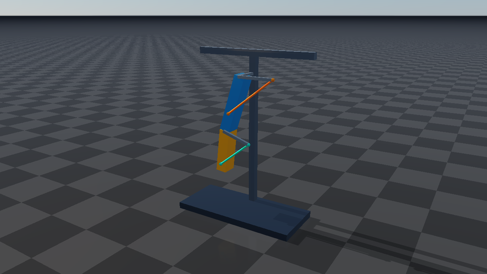

#############################
Tendon examples and Rayrai
#############################

For short C++ examples of individual features, including length locks,
bounded force control, and the existing wire API, start with :doc:`CodeExamples`.

The examples use procedural primitives and embedded URDF descriptions, so they
need no external robot or texture assets. Their source lives under
``examples/src/server/dynamics`` and ``examples/src/rayrai/dynamics`` in the
``raisim2Lib`` distribution. Shared construction and control code is in
``examples/include/tendon_scenes.hpp``; embedded mechanisms are in
``tendon_models.hpp``.

What each example demonstrates
==============================

.. list-table::
   :header-rows: 1
   :widths: 26 74

   * - Target
     - Behavior to inspect
   * - ``tendon_elastic``
     - Two suspended loads with equal springs but different damping. The
       spring interval is [0, 1.1], stiffness is 70, damping is 0.8 versus 7,
       friction loss is 0.05, armature is 0.04, and the independent upper length
       bound is 2.15. The lower-damped load oscillates longer.
   * - ``tendon_pulleys``
     - Two stations: a cylinder-wrapped cable between loads, and sphere
       wrapping followed by an independent divisor-2 branch. An exterior
       side site keeps each overhead route selected. A fixed tendon servos one
       slider at each station; the length-limited spatial cable transmits motion
       to the other load.
   * - ``tendon_coupling``
     - A two-link mechanism driven through the weighted coordinate
       ``shoulder + 0.25 * elbow``. An orange spatial tendon A crosses the
       shoulder and a turquoise spatial tendon B crosses the elbow. Their
       coupling enforces ``delta(LB) = -0.65 * delta(LA)``. The joint-angle
       ratio varies with cable geometry.
   * - ``rayrai_tendons``
     - The same constructions in one local window. Select a scene, pause,
       single-step, reset, change speed, and inspect live tendon values.

The combined scene contains nine tendons and one coupling. Six spatial tendons
produce visible cables; the three fixed tendons provide joint transmissions.
All moving bodies respond to simulated forces and constraints. The controller
changes servo targets instead of assigning animated body poses.

The coupling cables above are the actual spatial routes used by the constraint.
Earlier revisions of ``tendon_coupling`` coupled only fixed joint coordinates,
so they had no cable lines. Rebuild ``tendon_coupling`` and ``rayrai_tendons``
and restart the program to see this revised scene. Fixed tendons in general
still have no spatial route of their own.

Build and run
=============

From the ``raisim2Lib`` root on Linux:

.. code-block:: bash

   cmake -S . -B /tmp/raisim-tendon-examples \
     -DCMAKE_BUILD_TYPE=Release -DCMAKE_CXX_COMPILER=clang++-20 \
     -DRAISIM_EXAMPLE=ON
   cmake --build /tmp/raisim-tendon-examples --parallel 12 --target \
     tendon_elastic tendon_pulleys tendon_coupling rayrai_tendons
   /tmp/raisim-tendon-examples/examples/rayrai_tendons --scene all

Use the platform setup from :doc:`../BuildAndTest` on macOS and Windows. Omit the
Linux compiler override when using the normal macOS or Visual Studio toolchain.
With Visual Studio, build with ``--config Release`` and run ``.exe`` files from
``BUILD/bin``. Use an appropriate temporary/build directory for the host.
CMake checks installed package capabilities and skips unavailable tendon targets
with a message. No release version change is needed to enable the examples.

Normal license discovery applies. Every example accepts
``--activation-key /path/to/activation.raisim``. ``--help`` lists its options
without creating a world.

The three server examples publish on port 8080 by default. Run one and connect
``rayrai_tcp_viewer``; see :doc:`../RaisimServer` and :doc:`../RayraiTcpViewer`.
``--port N`` changes the requested port and the program prints the actual
listening port. Ctrl-C shuts it down cleanly. Viewer pause and single-step
commands are supported.

.. code-block:: bash

   ./tendon_pulleys --port 8080
   ./rayrai_tendons --scene elastic
   ./rayrai_tendons --scene coupling

The local example also accepts ``--scene pulley`` and ``--scene all``. Its
length/force display includes fixed tendons: interpret those values as
transmission coordinates and their conjugate forces, according to the selected
joint coefficients, rather than automatically treating them as cable metres
and Newtons.

Automatic tendon visualization
==============================

Rayrai draws spatial paths from the current simulated geometry, including
via-points, tangent segments, sphere arcs, cylindrical helices, side-site route
selection, and independent pulley branches. Each tendon uses an instanced
cylinder batch. Curves are tessellated for drawing; that tessellation does not
replace the analytic length calculation used by physics.

.. image:: ../../image/tendons.png
   :alt: Four stations in the automatic Rayrai tendon showcase
   :width: 100%

The same automatic paths work in a local ``raisin::RayraiWindow``, in a TCP
viewer receiving ``RaisimServer`` updates, and in a viewer simulating a loaded
native XML world. Custom cable-rendering code is unnecessary. Fixed tendons have no spatial route to draw. A coupling adds no separate
geometry of its own; its participating spatial tendons supply the visible paths.

.. code-block:: cpp

   auto appearance = cable->getProperties();
   appearance.width = 0.012;                 // Radius in metres.
   appearance.color = {1.0, 0.58, 0.08, 1.0};
   cable->setProperties(appearance);

Use alpha zero to hide the cable while keeping its physics active. Disabling
the tendon hides it and also disables its physics and dependent coupling rows.
Changing radius or color does not alter the physical route or forces. Geometry
and appearance refresh during scene updates, including while simulation time
is paused. Rename/removal, object removal, a world swap, or a TCP reconnect
cleans up obsolete drawings.

After scene synchronization, ``RayraiWindow::getTendonVisual(name)`` exposes the
generated batch for inspection. Rayrai owns and refreshes its geometry and
appearance. Ordinary viewer and external ``Camera`` captures include these
batches when visualization objects are enabled. RaiSim RGB/depth sensor overloads
retain their policy of excluding custom visualization objects. Physics ray casts
also do not intersect these massless visualization cables.

The server streams tendons using the existing instanced-polyline constraint
category. Drawing geometry is generated during rendering/server updates, rather
than tessellated on every headless physics step.

Headless checks and timings
===========================

``--headless`` and ``--benchmark`` select the same finite simulation mode: no
window, server socket, or real-time pacing. The default is 6,000 steps;
``--steps N`` changes it. These examples use a 1 ms physics timestep and one
simulation thread. Run benchmarks serially:

.. code-block:: bash

   OMP_NUM_THREADS=1 OPENBLAS_NUM_THREADS=1 MKL_NUM_THREADS=1 \
     ./tendon_pulleys --benchmark --steps 20000
   ./rayrai_tendons --headless --scene all --steps 6000

Each run reports elapsed simulation-loop time, microseconds per step, tendon
and coupling counts, maximum length/coupling errors, and maximum length change.
The measured loop includes control updates and diagnostic geometry refreshes.
It excludes scene construction and rendering. The examples reject nonfinite
state, length-bound violations above 0.01, and coupling residuals above 0.001;
runs of at least 1,000 steps also require measurable transmission motion. These
are example acceptance thresholds, not general solver accuracy guarantees.

For a reproducible finite rendering/capture run:

.. code-block:: bash

   ./rayrai_tendons --hidden --frames 90 --screenshot /tmp/tendons.png

The showcase on this page uses 90 rendered frames and 1,440 physics steps.
Finite-frame and hidden runs use a deterministic 16 ms simulation-time budget
per frame. Interactive runs normally follow wall time with the selected speed.
A working OpenGL context is still required for hidden rendering.

Export and reload
=================

.. code-block:: bash

   ./tendon_pulleys --headless --steps 0 --export /tmp/tendon-pulleys.xml
   ./rayrai_tendons --headless --steps 0 --export /tmp/all-tendons.xml

These commands export the initial configuration. The XML retains tendon paths,
properties, references, activation state, and current drive configuration.
Future C++ servo commands are not part of the exported scene, so loading a file
alone does not replay the demo controller. The exported embedded articulated
models have URDF sidecars; see :doc:`Reference` for path handling.

Register tests with ``RAISIM_TENDON_EXAMPLE_TESTS=ON``. Optionally set
``RAISIM_EXAMPLE_ACTIVATION_KEY`` to pass an explicit license to CTest. After
configuring from the repository root and building the four example targets,
include the export and coupling-check targets:

.. code-block:: bash

   cmake --build BUILD --target tendon_example_export_check \
     tendon_example_coupling_check tendon_example_coupling_tcp_check
   ctest --test-dir BUILD/examples -j 12 --output-on-failure -R tendon_example

For a standalone ``cmake -S examples -B BUILD`` configuration, use
``--test-dir BUILD``. On Windows also use ``--config Release`` for building and
``-C Release`` for CTest. The checks cover the individual/combined headless
scenes, invalid command-line arguments, XML/URDF export, and a round trip that
compares initial placement and controlled trajectories after 1,200 steps. The
finite Rayrai checks verify generated spatial visuals for the combined and
coupling scenes. A separate test checks that both coupling cables transmit
forces, and another compares their moving routes, radii, and colors after actual
server serialization and TCP viewer parsing. Each graphics test returns skip code 77
if SDL cannot create a graphics context.

For the engine source checkout, the ``TendonTest.*`` tests additionally cover
analytic lengths and gradients, moving-guide torques, force signs and ratios,
contact coupling, friction/stiction, implicit stiffness, armature curvature,
polynomial derivatives, particle attachments, enable/removal behavior,
XML/MJCF loading, and checkpoint replay. They can be selected from the engine's
CTest build with ``-R TendonTest`` and the same ``-j 12`` setting. The public
binary distribution's example tests do not require that source checkout.
