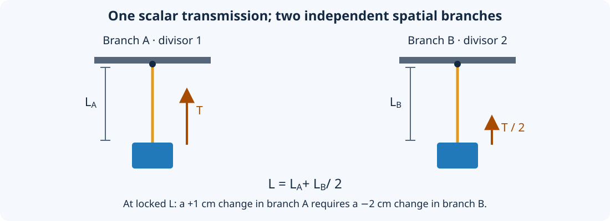

#############################
Tendon physics
#############################

This chapter describes the model implemented by RaiSim's tendon solver.
Use :doc:`../Tendons` for the workflow and :doc:`Reference` for parameter names.
The continuous equations explain the physical meaning; the discrete equations
specify how RaiSim advances that model during a timestep.

Length, velocity, and virtual work
==================================

Let :math:`q` denote the participating bodies' configuration, :math:`v` their
generalized velocities, and :math:`\ell` the tendon length. Define the row
Jacobian :math:`J` by the transmission's velocity map:

.. math::

   \ell = \ell(q,t), \qquad \dot\ell = Jv + v_{\mathrm{prescribed}}.

The offset accounts for motion of kinematic attachments and guides that the
solver cannot accelerate. For floating and ball-joint configurations, generalized
velocity is not simply the time derivative of every stored position parameter;
:math:`J` is expressed in RaiSim's generalized-velocity coordinates.

A signed scalar tendon force :math:`F` does virtual work
:math:`\delta W=F\,\delta\ell`. Therefore its generalized force is

.. math::

   \tau = J^T F, \qquad T=-F.

Here :math:`T` is the reported tension. Positive :math:`T` pulls toward shorter
length, while positive :math:`F` acts toward longer length. The actual direction
of motion also depends on external forces, inertia, contacts, and constraints.
A force sign does not by itself prescribe a velocity.

For a point with world position :math:`p_i`, define
:math:`g_i=\partial\ell/\partial p_i`. Its force is :math:`f_i=F g_i`.
On a rigid body with center of mass :math:`c`, this point contributes torque
:math:`(p_i-c)\times f_i`. On an articulated body, the point's kinematic Jacobian
maps the same force into joint/base generalized forces. Contributions on the
same object or joint are summed before computing the solver response. Internal
routes or repeated terms that cancel cannot spuriously accelerate that object.

Straight segments and via-points
================================

A segment from :math:`a` to :math:`b` contributes

.. math::

   s=\|b-a\|, \qquad
   \frac{\partial s}{\partial a}=-u, \qquad
   \frac{\partial s}{\partial b}=u, \qquad
   u=\frac{b-a}{\|b-a\|}.

Thus positive tension pulls its endpoints toward one another. A via-point
receives the sum of the adjacent segments' forces. If its object is dynamic,
that force and its moment accelerate the object; a world anchor supplies a
reaction without adding a dynamic degree of freedom.

Coincident endpoints have zero segment length and use a zero direction to avoid
division by zero. A collapsed segment consequently has no defined pulling
direction until its points separate. Avoid relying on it to initiate motion.

Sphere and cylinder wrapping
============================

Each wrapping primitive sits between two sites. Its center belongs to a rigid
body/link or the world; its radius belongs to the routing model. For an active
exterior wrap, the path consists of an incoming tangent segment, a surface arc,
and an outgoing tangent segment. The straight route is used when wrapping is
inactive.

For a sphere of radius :math:`r`, let :math:`\rho_a` and :math:`\rho_b` be the
endpoint distances from its center, and let :math:`\theta` be the selected
surface sweep in the plane through the endpoints and center. The routed length is

.. math::

   \ell_{\mathrm{sphere}} =
   \sqrt{\rho_a^2-r^2} + r|\theta| + \sqrt{\rho_b^2-r^2}.

For a cylinder, use endpoint distances projected onto the plane perpendicular
to its axis. If :math:`s_\perp` is the corresponding planar tangent/arc/tangent
length and :math:`\Delta z` is the endpoint separation along the axis, then

.. math::

   \ell_{\mathrm{cylinder}} = \sqrt{s_\perp^2 + (\Delta z)^2}.

Axial displacement is distributed in proportion to travel along the planar
route. The surface portion is a helix; treating it as a flat circular arc would
produce incorrect lengths, gradients, and axial forces. The cylinder is infinite:
its visual/collision height does not limit the routing surface.

The endpoint force directions follow the tangent segments. Equal and opposite
forces are applied at the two tangency points on the guide, including moments
about its center of mass. A translating or rotating dynamic guide therefore
receives reactions, and a moving kinematic guide transfers motion while keeping
its prescribed trajectory. Free dynamic bodies receive balanced internal
forces/moments; fixed or driven supports can exchange momentum and energy with
the rest of the scene.

Side sites and route selection
------------------------------

With no side site, the direct segment is used when it misses the obstacle;
otherwise the valid shorter exterior wrapping route is selected. A side site
outside the obstacle selects the side of the wrapping arc. It can retain an
overhead-pulley route even when the direct endpoint segment passes below and
misses the pulley. The route can release when the direct segment reaches the
selected side.

A side site is a routing hint, rather than an additional attachment through
which force is transmitted. It can belong to a body or to the world. Its
position selects the route, but it receives no point-force contribution merely
for serving as a side site.

An interior side site changes the routing mode: the path must intersect the
sphere, or the cylinder's cross-sectional disk. If the direct segment already
intersects it, the direct segment is used. Otherwise the route bends through a
single point on the near boundary that minimizes the two straight lengths.
This does not attach the tendon at the side site's exact position. For a
cylinder, inside/outside is evaluated perpendicular to the cylinder axis.

If an endpoint is on or inside an exterior wrapping surface, the implementation
falls back to the unwrapped segment. Wrapping assumes usable exterior endpoints;
it is not a penetration-resolution algorithm. Route selection, contact/release,
and zero-length segments introduce nonsmooth configurations. Small timesteps
and suitable initial placement are especially useful near those transitions.

Pulley branches and mechanical advantage
========================================

A pulley element divides the ordered path into independent branches. If branch
:math:`b` has ordinary routed length :math:`s_b` and positive divisor :math:`d_b`,

.. math::

   \ell = \sum_b \frac{s_b}{d_b}, \qquad
   J = \sum_b \frac{J_b}{d_b}, \qquad
   T_b = \frac{T}{d_b}.

The divisor scales both length and force. It does not duplicate a cable, add a
wheel, create a spatial point, or join the end of one branch to the start of the
next. Each branch starts and ends with sites. The initial divisor is 1; a leading
pulley element can replace it. Each subsequent pulley sets the following
branch's divisor directly, rather than multiplying the previous divisor.

For two branches with divisors 1 and 2, :math:`\ell=s_A+s_B/2`. If the total
length is locked, :math:`\dot s_B=-2\dot s_A`: the second branch moves twice as
far and receives half the tension. At :math:`T=10` N, its straight segments
carry 5 N. This is a virtual-work transmission ratio. An actual moving pulley
with several cable strands can also have force contributions from multiple
segments, which add at the pulley body.

Fixed tendons and units
=======================

A fixed tendon uses scalar revolute or prismatic joints:

.. math::

   \ell=\sum_i c_i q_i, \qquad
   \dot\ell=\sum_i c_i \dot q_i, \qquad
   \tau_i=c_iF.

The coefficients may be negative, zero, or repeated. The coordinate may also
be negative. Ball, floating, and fixed joints are rejected because they do not
provide the supported single revolute/prismatic coordinate. Joints may belong
to different articulated systems in the same world.

Choose coefficient units deliberately. If length is measured in metres, a
revolute-joint coefficient can represent a signed moment arm in m/rad and a
prismatic-joint coefficient a dimensionless ratio. If the coordinate instead
represents an angle, its conjugate force is a torque. Mixing joint types with
arbitrary unitless coefficients does not automatically create a physical length.

For the metre/Newton convention, parameters have these units:

.. list-table::
   :header-rows: 1
   :widths: 47 53

   * - Quantity
     - Unit
   * - Lengths, margin, drawing radius
     - m
   * - Force, tension, friction threshold, actuator bounds
     - N
   * - Spring stiffness and position gain
     - N/m
   * - Damping and velocity gain
     - N s/m
   * - Armature
     - kg
   * - Limit/coupling compliance and friction regularization
     - m/N, used in the discrete equations below
   * - Activation time
     - s
   * - Position correction, pulley divisor, RGBA
     - Dimensionless

For a general transmission coordinate :math:`\ell`, force has units of energy
per unit :math:`\ell`, stiffness has force/length units, and armature has
force-time-squared/length units. The drawing radius always remains a spatial
radius in metres, including when the physical transmission has other units.

Spring, slack interval, and damping
===================================

Let :math:`[\ell_s^-,\ell_s^+]` be the spring interval and define

.. math::

   e=\ell-\operatorname{clamp}(\ell,\ell_s^-,\ell_s^+), \qquad
   U=\tfrac12 k e^2, \qquad
   F_{\mathrm{spring}}=-ke, \qquad F_{\mathrm{damping}}=-d\dot\ell.

Equal endpoints define an ordinary rest length. Unequal endpoints define a
zero-spring-force interval: below it the spring pushes toward larger length;
above it the spring pulls toward smaller length. ``[0, L]`` produces a pull-only
spring for a spatial path. Damping remains active inside the spring interval.

The spring and damping share an implicit solver row. With timestep :math:`h`,
current error :math:`e_n`, and the solved end-step length velocity
:math:`\dot\ell_+`, the passive impulse satisfies

.. math::

   p_{\mathrm{passive}} =
   -h k_a e_n - h(d+h k_a)\dot\ell_+.

Here :math:`k_a=k` outside the interval, or for equal spring endpoints, and
:math:`k_a=0` inside an unequal-endpoint interval. The active region and the
geometry Jacobian are evaluated at the start of the step. Crossing a slack
boundary within that step is not a continuous event solve.

The extra :math:`h k_a` term comes from evaluating spring extension using the
linearized end-step length :math:`\ell_n+h\dot\ell_+`. This prevents the explicit
spring-force instability at high stiffness, while introducing the numerical
damping and approximation associated with implicit integration. Stability
alone does not establish timestep-independent accuracy.

For the introductory 1 kg suspended load, the static balance above the spring
interval is :math:`k(\ell-1)+2=9.81` N. With :math:`k=500` N/m, the equilibrium
length is 1.01562 m. The actuator supplies 2 N of tension, while the total tension
balances the load's weight. The independent 1.5 m upper constraint is inactive.

Actuator and activation dynamics
================================

Let :math:`u` be ``Drive::force``, :math:`a` the filtered feedforward force,
:math:`k_p,k_v` the position and velocity gains, and
:math:`\ell_d,\dot\ell_d` the targets. The intended force law is

.. math::

   F_{\mathrm{drive}}=a+k_p(\ell_d-\ell)+k_v(\dot\ell_d-\dot\ell).

For activation time :math:`\tau>0`, the feedforward state advances by the exact
first-order update for a command held constant over one timestep:

.. math::

   a_{n+1}=u+(a_n-u)e^{-h/\tau}.

A newly created tendon starts with zero activation. With zero activation time,
:math:`a_{n+1}=u`. Only feedforward force is filtered: targets, gains, passive
forces, and constraint forces are not passed through this activation filter.
This scalar filter does not constitute a muscle force-length/force-velocity or
biochemical activation model.

Position/velocity feedback is implicit. The discrete actuator relation is

.. math::

   \begin{aligned}
   r &= a_{n+1}+k_p(\ell_d-\ell_n)+k_v\dot\ell_d,\\
   F_{\mathrm{drive},+} &= \operatorname{clamp}\left(
     r-(k_v+h k_p)\dot\ell_+,\ F_{\min},F_{\max}\right).
   \end{aligned}

Its impulse is :math:`hF_{\mathrm{drive},+}`. The bounds apply to the combined
feedforward and servo force of this tendon, after activation and feedback.
They exclude springs, damping, friction, armature, length limits, and coupling
reactions. Bounds may exclude zero; in that case a zero command can still
produce the nearest allowed nonzero actuator force.

Armature and route curvature
============================

Armature :math:`a_t\geq0` stores kinetic energy

.. math::

   K_t=\tfrac12 a_t\dot\ell^2.

For an unconstrained, autonomous transmission it contributes the generalized
mass term :math:`a_tJ^TJ` and the curvature force term
:math:`-a_tJ^T\dot Jv`. It adds inertia along the transmission rather than equally
in every spatial direction. Several tendons contribute their own coupled
transmission inertia through their solver rows.

For a spatial tendon with moving endpoints or guides, let :math:`b_\ell` denote
the length acceleration caused by kinematics with generalized acceleration held
zero, including changes of direction. The armature row uses

.. math::

   p_{\mathrm{armature}} =
   a_t\left(\dot\ell_n-h b_\ell-\dot\ell_+\right).

RaiSim estimates this bias with a centered second difference of routed length,
using endpoint and guide-axis kinematics. Fixed tendons have constant scalar
joint coefficients and use zero curvature bias.

For a 1 kg body on a straight radial transmission with armature 3 kg, an 8 N
radial force initially produces 2 m/s² radial acceleration. If the body instead
has transverse velocity 2 m/s at radius 1 m, the length curvature is
:math:`v_\perp^2/\ell=4` m/s². With no applied radial force, the armature term
produces radial acceleration :math:`-3` m/s². Omitting curvature would miss this
reaction even though the instantaneous length velocity is zero.

Shared impulse solver
=====================

The world first computes unconstrained velocity changes from body dynamics.
Tendon rows and contact rows then share iterative velocity updates. Springs,
drives, friction, armature, limits, and couplings therefore respond to changes
made by other rows during a sweep; they are not independent post-processing
forces applied after contact resolution.

For one row, let :math:`p` be its accumulated impulse, :math:`b` its target
velocity, :math:`\gamma` its softness, and :math:`M^{-1}` the participating
bodies' inverse mass response. Define :math:`W=JM^{-1}J^T`. One projected update is

.. math::

   \begin{aligned}
   p_{\mathrm{new}} &= \operatorname{clamp}\left(
     p-\frac{Jv+v_{\mathrm{prescribed}}-b+\gamma p}{W+\gamma},
     p_{\min},p_{\max}\right),\\
   v &\leftarrow v+M^{-1}J^T(p_{\mathrm{new}}-p).
   \end{aligned}

Prescribed-motion objects contribute velocity offsets but no inverse mass.
Multiple points and joints on the same articulation share its inverse mass
matrix. Solver iteration limits and convergence tolerance apply to the combined
contact/tendon problem. The matrix expression explains the response; it does
not imply that each tendon is solved in isolation with a constant effective mass.

After solving, each row's reported force is its impulse divided by :math:`h`.
A prescribed force can still be reported for a transmission whose dynamic
Jacobian is zero, including all-static endpoints. Such a transmission has no
motion response to that force. An inconsistent hard constraint with no available
degrees of freedom cannot move its endpoints into compliance.

Length bounds, margin, and compliance
=====================================

Lower and upper bounds are separate unilateral rows. A lower row can only exert
positive force; an upper row can only exert negative force. They can act
predictively before a bound is crossed, limiting the end-step closing velocity.
They do not directly clamp the stored configuration to a target length.

With margin :math:`m`, define the signed gaps

.. math::

   g_{\mathrm{low}}=\ell-\ell_{\min}-m, \qquad
   g_{\mathrm{high}}=\ell_{\max}-\ell-m.

Let :math:`\eta(g)=\beta` for :math:`g<0` and 1 otherwise, where
:math:`\beta` is ``positionCorrection``. The row targets and impulse bounds are

.. math::

   \begin{aligned}
   b_{\mathrm{low}}&=-\eta(g_{\mathrm{low}})g_{\mathrm{low}}/h,
   &p_{\mathrm{low}}&\in[0,+\infty),\\
   b_{\mathrm{high}}&=\eta(g_{\mathrm{high}})g_{\mathrm{high}}/h,
   &p_{\mathrm{high}}&\in(-\infty,0].
   \end{aligned}

Positive margin moves the effective boundaries inward to
:math:`\ell_{\min}+m` and :math:`\ell_{\max}-m`; it is not merely a reporting
threshold. Choose a margin compatible with the permitted interval. Overlapping
effective boundaries create conflicting requirements.

Equal finite bounds create one bilateral lock with target
:math:`b=\beta(\ell_{\mathrm{target}}-\ell)/h` and unbounded signed impulse.
Margin is ignored for this equality case. The default correction fraction is
0.2: in an isolated linear hard equality, that targets removal of 20% of existing
position error in one step. Zero correction prevents correction of existing
violation; 1 targets full linearized correction. Strong correction can inject
energy and cause abrupt transients.

For compliance :math:`c`, row softness is :math:`\gamma=c/h^2`. Zero compliance
selects a hard velocity constraint, subject to solver convergence and geometric
linearization. Positive compliance allows residual constraint error under load.
For a bilateral row with error :math:`C`, the converged relation is

.. math::

   h\dot C_+ + \beta C + cF = 0.

This makes the parameter interaction explicit. At static equilibrium with
:math:`\beta>0`, :math:`F=-\beta C/c`; therefore numerical compliance and position
correction together determine the apparent static stiffness. Use the spring
``stiffness`` parameter for a directly specified elastic force law, and use the
constraint equation when calibrating a compliant lock or limit.

Dry friction and stiction
=========================

Dry friction targets zero length velocity with

.. math::

   b=0, \qquad
   p\in[-hF_f,hF_f], \qquad
   \gamma=c_f/h^2.

Here :math:`F_f` is ``frictionLoss`` and :math:`c_f` is
``frictionCompliance``. With zero compliance, a subthreshold disturbance can be
balanced by an interior impulse while the transmission remains at rest. During
sliding the impulse saturates at the threshold and opposes motion. It can bring
a sufficiently small velocity to zero without reversing it simply because a
fixed friction force overshot the stop.

Positive friction compliance regularizes this condition. In an unsaturated row,
:math:`\dot\ell_+=-c_fF/h`, so nonzero balancing force permits creep. It should
not be interpreted as exact stiction with the same threshold. Unlike viscous
damping, dry friction can produce a finite opposing force at zero velocity.

Polynomial tendon couplings
===========================

Let the captured references be :math:`\ell_{1,0},\ell_{2,0}` and define

.. math::

   \begin{aligned}
   x&=\ell_2-\ell_{2,0},\\
   f(x)&=c_0+c_1x+c_2x^2+c_3x^3+c_4x^4,\\
   C&=\ell_1-\ell_{1,0}-f(x)=0.
   \end{aligned}

Coefficient :math:`c_i` has units of the first length coordinate divided by
the second coordinate to power :math:`i`; the constant term has first-length
units. Choose coefficients accordingly when coupling different kinds of
transmission coordinates.

The coupling row has Jacobian and force distribution

.. math::

   J_C=J_1-f'(x)J_2, \qquad
   F_1=\lambda, \qquad F_2=-f'(x)\lambda.

The derivative controls both velocity ratio and force transmission. Using the
polynomial value as a force coefficient would violate virtual work. For
``{0, 2, 0.1, 0, 0}``, the relation is :math:`\Delta\ell_1=2x+0.1x^2` and the
instantaneous ratio is :math:`2+0.2x`.

``TendonCoupling::getForce()`` returns :math:`\lambda`. Each tendon's total force
includes its respective contribution above. Coupling compliance uses
:math:`\gamma=c/h^2`, target velocity is :math:`-\beta C/h`, and the impulse is
bilateral. The polynomial and derivative are evaluated once for the step; a
nonlinear equality is enforced through this local linearization and subsequent
position correction, rather than an exact nonlinear position projection.

Passing a null second tendon constrains the first to
:math:`\ell_{1,0}+c_0`; higher coefficients then have no effect. Disabling the
coupling or either participating tendon removes the row. The first and second
tendons must be distinct and belong to the same world.

Energy interpretation
=====================

The spring potential and armature kinetic energies above are the quantities
returned by the tendon energy getters. They exclude body energy, actuator work,
and any energy associated with compliant limit/coupling/friction rows.
Passive damping and ideal sliding friction dissipate energy. Drives and moving
kinematic supports can supply it. Constraint position correction and finite-step
implicit integration can also change mechanical energy numerically. Use a
whole-system energy/work balance when diagnosing a mechanism; summing only the
tendon energy getters is not a conservation test for the complete world.
