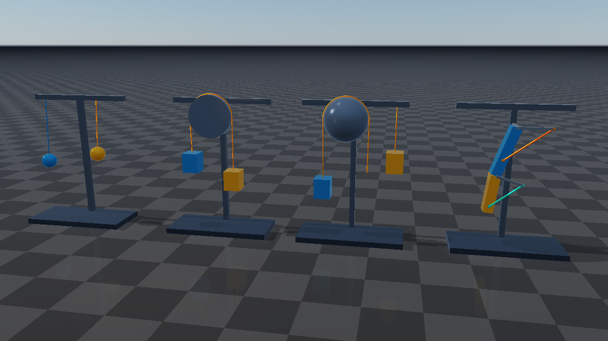

# Tendon examples

These examples use RaiSim's spatial and fixed tendon APIs and Rayrai's automatic
tendon rendering. All geometry and articulated mechanisms are created in C++;
no robot files or texture assets are required. Use a current RaiSim/Rayrai
package containing tendon support. CMake skips unsupported targets with a
message when an older package is installed.

| Target | Demonstration |
| --- | --- |
| `tendon_elastic` | Two suspended loads with pull-only springs, different damping, friction loss, armature, and independent hard length bounds. |
| `tendon_pulleys` | An overhead cylinder cable and sphere wrapping with a separate 2:1 pulley branch; fixed tendons servo the loads. |
| `tendon_coupling` | A weighted joint actuator drives a two-link mechanism while an equality couples two visible spatial cables. |
| `rayrai_tendons` | All three demonstrations in one local Rayrai window, with scene selection, pause, single-step, reset, speed, and live length/tension values. |

## Build and run

From the `raisim2Lib` root, use the usual package setup:

```sh
cmake -S . -B /tmp/raisim-tendon-examples -DCMAKE_BUILD_TYPE=Release \
  -DCMAKE_CXX_COMPILER=clang++-20 -DRAISIM_EXAMPLE=ON
cmake --build /tmp/raisim-tendon-examples --target \
  tendon_elastic tendon_pulleys tendon_coupling rayrai_tendons --parallel 12
/tmp/raisim-tendon-examples/examples/rayrai_tendons
```

Use Clang 20 on Linux. On macOS use the project's normal compiler setup. With
Visual Studio on Windows, omit the Linux compiler option, build with
`--config Release`, and run executables from `BUILD/bin`.

The three `tendon_*` programs publish to `RaisimServer` on port 8080. Start one
and connect `rayrai_tcp_viewer` in another terminal. `--port N` selects a port;
the program prints the actual listening port if the requested one was occupied.
Viewer pause/step controls are supported. Ctrl-C stops the server cleanly.

```sh
./tendon_pulleys --port 8080
./rayrai_tendons --scene elastic
./rayrai_tendons --scene coupling
```

Normal RaiSim license discovery applies. Add `--activation-key /path/to/activation.raisim`
to use an explicit license. `--help` lists options without creating a world.



## Routing and controls

The small server entry points share scene construction in
[`include/tendon_scenes.hpp`](include/tendon_scenes.hpp). Start with
`addElasticStation`, `addPulleyStation`, or `addJointStation` to inspect the
relevant tendon API. The same functions create the local Rayrai scenes.

Spatial tendons draw their actual routes, including curved wrap segments.
Their `width` is a radius; RGBA controls appearance. Pulley elements split paths
into independent branches rather than drawing a bridge between them. A divisor
of 2 halves that branch's contribution to tendon length and transmitted force.
The fixed-tendon servo applies forces to the joints; the moving bodies are not
animated by assigning positions. Fixed tendons have no spatial cable to draw.

In `tendon_coupling`, the orange shoulder cable A and turquoise elbow cable B
are real spatial tendons. Their equality is `delta(LB) = -0.65 * delta(LA)`,
relative to their lengths at creation. The joint-angle ratio varies with cable
geometry. The weighted fixed-tendon actuator uses `shoulder + 0.25 * elbow`;
its coordinate/force are generalized quantities, while A and B report metres
and newtons. The displayed cable routes are the ones used by the coupling.


Earlier versions of this example coupled only joint-coordinate tendons and
therefore had no cable lines. Rebuild `tendon_coupling` and `rayrai_tendons`, then
restart the program to load the revised scene.

## Export, tests, and timing

Export an initial scene as native XML, then open it with the existing XML loader
or drop it onto the TCP viewer. XML preserves tendon configuration and the
initial drive commands. The C++ demo's time-varying servo targets are not stored
as an animation in XML. Embedded articulated models are exported as URDF
sidecar files beside the XML. The XML uses absolute URDF paths; update those
references if relocating the exported scene.

```sh
./tendon_pulleys --headless --steps 0 --export /tmp/tendon-pulleys.xml
./rayrai_tendons --headless --steps 0 --export /tmp/all-tendons.xml
```

Headless runs create no graphics context or server, use one physics thread,
and have no real-time pacing. They check finite state, length and coupling
errors, and meaningful motion for runs of at least 1,000 steps. Timing includes
control updates and these diagnostics.

```sh
OMP_NUM_THREADS=1 OPENBLAS_NUM_THREADS=1 MKL_NUM_THREADS=1 \
  ./tendon_pulleys --benchmark --steps 20000
./rayrai_tendons --headless --scene all --steps 6000
./rayrai_tendons --hidden --frames 90 --screenshot /tmp/tendons.png
```

Enable `RAISIM_TENDON_EXAMPLE_TESTS=ON` at configure time to register the headless,
CLI/export, XML trajectory round-trip, coupled spatial-route/force checks,
and local/TCP Rayrai checks. Optionally set
`RAISIM_EXAMPLE_ACTIVATION_KEY=/path/to/activation.raisim` for the test commands.
For a build configured from the repository root:

```sh
cmake --build BUILD --target tendon_example_export_check \
  tendon_example_coupling_check tendon_example_coupling_tcp_check
ctest --test-dir BUILD/examples -j 12 --output-on-failure -R tendon_example
```

For a standalone `cmake -S examples -B BUILD` build, use `--test-dir BUILD`.
On Windows, also pass `-C Release`. The `gpu` tests skip with exit code 77 if
SDL cannot create a graphics context. All generated test XML and captures use
temporary directories or explicit output paths.

## Recorded validation

Validated on 2026-09-06 with Linux x86-64, Clang 20.1.8, Release mode, and the
installed RaiSim/Rayrai packages. All ten CTests passed with `ctest -j 12`.
The three TCP servers also completed finite startup/step/shutdown runs. The
showcase above was captured after 90 frames (1,440 physics steps), with 85
rendered cable segments. macOS, Windows, and ARM were reviewed for portable
APIs but were not executed on this host.

Serial timings on an AMD Ryzen 9 3950X, median of five 20,000-step runs:

| Target | Microseconds per step |
| --- | ---: |
| `tendon_elastic` | 3.62 |
| `tendon_pulleys` | 10.36 |
| `tendon_coupling` | 3.70 |
| `rayrai_tendons` | 22.81 |

These timings include controller updates and finite-state/constraint diagnostics;
`rayrai_tendons` was measured in headless mode with all scenes enabled.
