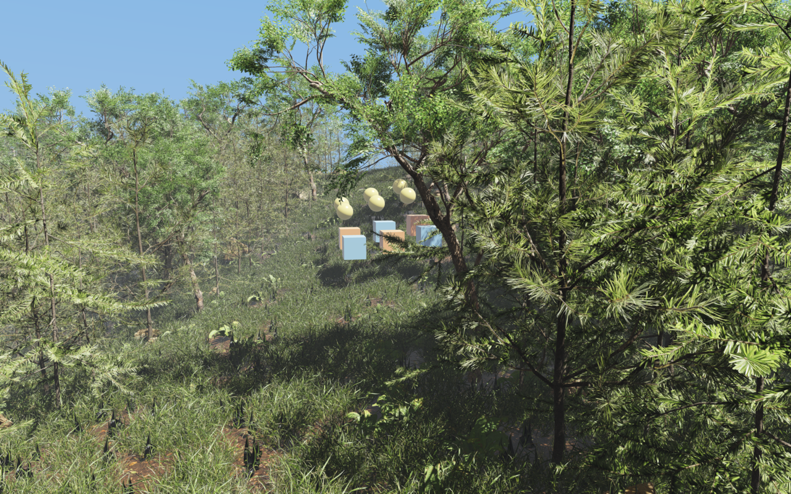

# Dense forest terrain and physics



`rayrai_forest` is a small native Rayrai example with an **80 × 80 m** rolling
heightmap, hills, a gully, and continuous grass coverage. The terrain is static;
“dynamic” here means varied terrain shape, with animated foliage and simulated
objects. The same 161 × 161 heightmap supplies both collision and plant heights.

- **1,888 trees:** 880 pine saplings, 880 fir saplings, and 128 broadleaf wild syringa.
- **61,200 ground-cover instances:** 18,000 each of Bermuda grass and the two
  medium grasses, plus 1,800 each of fern,
  dandelion, nettle, and periwinkle. This adds the requested two trees and five
  ground-cover types to the original forest's one tree and two grasses.
- **180 mossy rocks:** six Poly Haven shapes with varied sizes and orientations,
  shared textures, instancing, automatic LOD, and shadows.
- **Twelve dynamic Raisim objects:** six crates and six rolling balls.
- Instanced batches, automatic mesh LOD, projected-size thinning, foliage shadow
  LOD, shadow casting enabled by default for every vegetation batch, three directional
  shadow cascades, 4× MSAA, wind, and brown soil with scattered leaf litter
  ([Mud Forest](https://polyhaven.com/a/mud_forest)). The ground uses subdued
  normal relief and high roughness to blend with the vegetation and mossy rocks.
- Strong direct sunlight (diffuse/specular strength 18, previously 5)
  and base exposure 1.1 give exposed leaves bright, near-white highlights under
  the ACES tone curve. Ambient fill stays unchanged to preserve deep canopy
  shadows; no light-shaft effect is added.
- A subtle cool-gray haze separates distant foliage, using 1,200 m weather
  visibility and the existing height fog. Nearby leaves retain their contrast.

Vegetation and rocks are visual-only; collision is provided by the terrain and twelve
physics objects. Every imported plant is individually rooted at local Z=0.
Display-lineup translations are removed before scattering, preventing floating
clusters on hillsides. Grass and ground cover span the entire heightmap, including
the former trail, steep slopes, terrain edges and the area around the physics
objects. The terrain has no contrasting trail tint. Grass increases from 43,200
to 54,000 clumps to maintain density across the larger covered area. Trees stay
upright and avoid steep slopes, the view corridor and the physics clearing.
Crowns overlap for a dense canopy,
while tree roots remain at least 0.8 m apart. Trees extend closer to the
view corridor than in the original sparse layout. Rocks avoid tree trunks and each
other; their rounded bases are embedded using terrain samples around the contact
patch. More rocks appear along the view corridor. Their complete footprints
stay outside the corridor and physics clearing, which now also contain grass.

The example consists of [the viewer](rayrai_forest.cpp),
[viewer setup](forest_viewer.hpp), and a
[scene helper](forest_scene.hpp). No editor scene file or runtime
Python dependency is needed. A small [loading overlay](forest_loading.hpp)
shows asset progress across the top while meshes import asynchronously and
finish GPU uploads. It disappears automatically once all assets are ready,
and does not intercept camera input. Physics waits until loading finishes.
[Loading-screen capture](../../../images/forest_loading.png). Scattering uses a fixed seed and portable integer
random-number conversion. Simulation runs eight 2 ms steps per rendered frame
on the calling thread, including during benchmarks.

## Build and run

Use the checkout's Raisim/Rayrai packages and a valid Raisim activation key.
From the `raisim2Lib` root on Linux:

```sh
cmake -S examples -B /tmp/raisim-forest-build -G Ninja \
  -DCMAKE_BUILD_TYPE=Release -DCMAKE_CXX_COMPILER=clang++-20 \
  -DRAISIM_PREFIX="$PWD/raisim" -DRAYRAI_PREFIX="$PWD/rayrai" \
  -DRAISIM_FOREST_EXAMPLE_TESTS=ON -DRAISIM_FOREST_GPU_TESTS=ON
cmake --build /tmp/raisim-forest-build --target rayrai_forest forest_render_test forest_scene_test forest_shadow_test forest_loading_test -j12
/tmp/raisim-forest-build/rayrai_forest
```

The target also participates in the normal top-level examples build. Use the
platform's normal compiler/generator on macOS and Windows; the example has no
Linux-specific API or architecture-specific flags. Those platforms have not
been runtime-tested for this addition.

The asset path defaults to this checkout's `../../../rsc/forest`. To relocate
an executable, copy that directory and pass `--assets /path/to/forest`.
Use the viewer's standard mouse/keyboard camera controls to explore.

```sh
ctest --test-dir /tmp/raisim-forest-build -j12 --output-on-failure -R '^forest_'
python3 examples/tools/benchmark_forest.py \
  --viewer /tmp/raisim-forest-build/forest_render_test \
  --out /tmp/forest-benchmark.json --frames 300 --runs 3
/tmp/raisim-forest-build/forest_render_test --frames 3
```

GPU tests and hidden runs still require a desktop OpenGL context. GPU tests run
serially; the benchmark forces numerical-library thread counts to one and runs
one viewer at a time. FPS includes simulation, rendering, UI, swap, and GPU
completion, after all assets finish loading and 60 subsequent warm-up frames; loading is excluded. The first load
can take tens of seconds because Rayrai builds LODs for the high-detail meshes.
Those exact prepared meshes are now saved beside each asset as
`rayrai_cache_model.gltf.lods`. Later launches read the cached levels on a worker
instead of rebuilding them. The measured forest load falls from **27.20 seconds
to 4.70–4.91 seconds** (about **82% less time**); first-time cache creation takes
26.88 seconds. Async loading and the progress bar remain active throughout.

The 16 optional cache files add **282 MiB** to the original 131.5 MiB bundle.
They are generated locally, ignored by Git, and can be deleted to reclaim space;
Rayrai recreates them on demand. Full geometry fingerprints detect changed
external buffers and LOD-affecting material settings. Other material and texture
properties come from the current import. Invalid or damaged caches are ignored.
A read-only asset directory uses the system temporary cache directory instead.
No vertex precision, geometry, LOD settings or rendering quality is reduced.

Set `RAYRAI_ASYNC_LOD_CACHE_DIR` to choose a cache directory, or
`RAYRAI_DISABLE_ASYNC_LOD_CACHE=1` to measure the uncached path. To reproduce
first versus subsequent launches, use a new, empty cache directory:

```sh
python3 examples/tools/benchmark_forest_loading.py \
  --viewer /tmp/raisim-forest-build/forest_render_test \
  --out /tmp/forest-loading-results --cache-dir /tmp/forest-loading-cache \
  --runs 3
```

[Loading measurements](../../../images/forest_loading_benchmark.json).

Import, base-geometry preparation, and instanced LOD generation run on workers.
Material/texture resolution and incremental GPU uploads use the render thread.
The loading bar includes all preparation stages. The regression runner rejects
a loading update longer than one second; the cached-launch benchmark peaked at about
0.404 seconds per loading update, compared with the earlier 24.1-second
render-thread stall. Short upload or
texture-resolution hitches remain possible.
The supplied preview shows the scene shortly after the objects drop. The example
renders interactively and has no capture, frame limit, hidden mode, or timing
code. Bounded rendering and benchmarks use the separate `forest_render_test`
runner, sharing the same scene setup.

## Latest renderer depth optimization

Rayrai specializes depth reduction for the framebuffer's actual MSAA sample
count and skips edge checks only when the viewport contains complete tiles.
Every sample and visibility decision is preserved. A benchmark replaying actual
forest depth buffers takes **2.32% less time** for depth copy, reduction and
readback (170.92 → 166.96 microseconds per capture).

Complete forest A/B/B/A results remain within variation: 15.249 → 15.261 FPS
moving and 16.785 → 16.768 FPS stationary. This is not an overall FPS gain.
All eight paired images are identical, all 41 renderer/example tests pass, and
foliage showcases and this preview are refreshed. Async loading and its progress
UI stay enabled. Set `RAYRAI_DISABLE_FOLIAGE_DEPTH_SPECIALIZATION=1` to compare
the preceding kernel.

## Earlier renderer bounds optimization

Rayrai now caches each plant's exact world-space bounding sphere and box extents
across camera movement and shadow passes. Instance or mesh-bound edits invalidate
the cache; wind expansion remains current. The focused renderer preparation/
submission benchmark takes 13.58% less time. Full forest A/B/B/A results remain
within variation: 15.230 → 15.288 FPS moving and 17.090 → 17.014 FPS stationary.
All paired captures match exactly, and all 41 relevant renderer/example tests pass.
The measured SDK and preview are updated. Async loading and its progress UI stay
unchanged. Set `RAYRAI_DISABLE_FOLIAGE_WORLD_BOUNDS_CACHE=1` to compare fresh bounds.

## Earlier depth-tile optimization

Foliage visibility now uses cached power-of-two reciprocals and integer
truncation to select the same depth tiles with fewer operations. A focused
coordinate benchmark takes 78.81% less CPU time. Serial 300-frame A/B/B/A forest
runs measure 17.012 → 17.102 FPS stationary and 15.163 → 15.232 FPS moving;
these small differences remain within measurement variation. Paired images
match exactly. All 40 relevant renderer/example tests pass, and the tested SDK
and preview are updated. Density, lighting, shadows and async loading are unchanged.

## Assets and reproduction

The shipped resources occupy approximately **131.5 MiB**. The broadleaf tree
accounts for most of this: its original geometry contains about two million
triangles. Rayrai builds lower-detail representations for rendering. Textures
are 1K, and only one plant from each original model lineup is retained.

All models and terrain textures are from [Poly Haven](https://polyhaven.com),
under its [CC0 asset license](https://polyhaven.com/license).
Powered by Poly Haven. Original download URLs and SHA-256 hashes are recorded
in [sources.json](../../../rsc/forest/sources.json); the prepared bundle's hashes are in
[manifest.json](../../../rsc/forest/manifest.json). Asset IDs correspond to
`https://polyhaven.com/a/<asset-id>`.

To reproduce the shipped resources using Python's standard library:

```sh
python3 examples/tools/download_forest_assets.py /tmp/forest-assets
python3 examples/tools/prepare_forest_assets.py /tmp/forest-assets
python3 examples/tests/test_forest_assets.py /tmp/forest-assets/prepared
```

Run the viewer with `--assets /tmp/forest-assets/prepared` to inspect the result.
The preparation scripts select a single plant, remove unused plant geometry,
rotate Y-up meshes to Z-up, align the lowest vertex to zero, and add leaf
transmission metadata. Pine/fir twig geometry uses opaque rendering because
its source color texture has no alpha. The shaders keep the actual needles.
Six rock shapes share their original buffers and textures, with display offsets
removed and each shape normalized to a one-metre horizontal bounding radius.
Regeneration downloads the current Poly Haven versions; the shipped source
hashes identify the exact versions used here.

## Latest renderer performance

Rayrai prepares exact shadow-caster plane data once per foliage draw and
evaluates the independent comparisons together. Longer full-forest A/B/B/A
measured moving **20.3757 → 20.2707 FPS (-0.52%)**; stationary **22.0928 → 22.1440 FPS (+0.23%)** on an RTX 2070 SUPER (600 frames/run).
The initial moving screen measured -1.34%; moving A/B/B/A measured -0.25%, and the longer repeat measured -0.52%. Stationary rendering measured +0.23%. Moving run ranges overlap and the controls drift, so no reliable overall FPS improvement is established; a small moving-camera regression cannot be excluded. The retained benefit is cheaper CPU receiver checks and repeatably lower CPU draw-preparation/submission time, with identical output.
Focused receiver checks take 44.80% less CPU time;
renderer preparation/submission takes 5.89% less.
All fourteen captures are byte-identical; all 54 renderer/forest tests pass.
The measured SDK and preview are installed with unchanged quality and async loading.
See [measurements](../../../images/forest_benchmark.json) and
[test results](../../../images/forest_tests.txt).

Previous performance work:

Rayrai evaluates the six foliage frustum planes together, preserving exact
visibility while reducing CPU work. Serial full-forest A/B/B/A measured moving **21.1636 → 21.2574 FPS (+0.44%)**; stationary **22.2105 → 22.2384 FPS (+0.13%)**
on an RTX 2070 SUPER (300 moving and 600 stationary frames/run).
The moving repeat measures +0.44% and stationary rendering +0.13%, with overlapping run ranges and drifting controls. These differences do not establish a reliable overall FPS gain. The retained benefit is 71.10% less CPU time for the exact frustum check and 2.61% less CPU preparation/submission time in the renderer fixture.
All paired captures are byte-identical; all 53 renderer/forest tests pass.
The measured SDK and preview are installed with unchanged density, geometry,
LOD, lighting, shadows, wind, MSAA, asynchronous loading and progress overlay.
See [measurements](../../../images/forest_benchmark.json) and
[test results](../../../images/forest_tests.txt).

Previous performance work:

Rayrai caches exact foliage occlusion tile coordinates while testing current
depth. Serial full-forest A/B/B/A measured moving **21.0036 → 21.0710 FPS (+0.32%)**; stationary **22.0333 → 22.1923 FPS (+0.72%)**
on an RTX 2070 SUPER (300 moving and 600 stationary frames/run).
The moving repeat improves by 0.32% with overlapping run ranges; stationary improves by 0.72%, but its controls drift downward. These small differences do not establish a reliable overall FPS gain. The retained benefit is 48.12% less CPU time for repeated occlusion queries when bounds can be reused, with unchanged visibility and pixels.
Focused repeated tile queries take 48.12% less CPU time.
All paired captures are byte-identical; all 52 renderer/forest tests pass.
The measured SDK and preview are installed with unchanged density, geometry,
LOD, lighting, shadows, wind, MSAA, asynchronous loading and progress overlay.
See [measurements](../../../images/forest_benchmark.json) and
[test results](../../../images/forest_tests.txt).

Previous performance work:

Rayrai reuses repeated products when projecting foliage bounding-box corners,
with bit-identical results. Serial full-forest A/B/B/A measured moving **20.9180 → 21.1540 FPS (+1.13%)**; stationary **22.1367 → 22.0755 FPS (-0.28%)**
on an RTX 2070 SUPER (300 moving and 600 stationary frames/run).
Moving performance improved by 1.13% in A/B/B/A, with both optimized runs faster than both controls; the initial screen measured +0.32%. Stationary performance is effectively unchanged (-0.28%, with overlapping run ranges); no stationary speedup is claimed.
Focused CPU box projection takes 34.35% less time.
All paired captures are byte-identical; all 52 renderer/forest tests pass.
The measured SDK and preview are installed with unchanged density, geometry,
LOD, lighting, shadows, wind, MSAA, asynchronous loading and progress overlay.
See [measurements](../../../images/forest_benchmark.json) and
[test results](../../../images/forest_tests.txt).

Previous performance work:

Rayrai counts single-source foliage visibility directly from disjoint LOD
group sizes, removing per-instance accounting scans. Serial full-forest A/B/B/A
measured moving **20.8717 → 20.9224 FPS (+0.24%)**; stationary **21.9663 → 22.0699 FPS (+0.47%)** on an RTX 2070 SUPER (300 moving and 600 stationary frames/run).
The initial moving screen measured +0.46%; the moving A/B/B/A repeat measured +0.24%, and stationary A/B/B/A measured +0.47%. Run ranges overlap in both A/B/B/A trials, so these results do not establish an overall FPS gain. The retained benefit is a measured reduction in CPU preparation/submission work with unchanged output.
Focused CPU submission takes 7.32% less time.
All paired captures are byte-identical; all 51 renderer/forest tests pass.
The measured SDK and preview are installed with unchanged density, geometry,
LOD, lighting, shadows, wind, MSAA, asynchronous loading and progress overlay.
See [measurements](../../../images/forest_benchmark.json) and
[test results](../../../images/forest_tests.txt).

Previous performance work:

Rayrai caches exact foliage wind phases and prepares collector records directly
in retained storage. Serial full-forest A/B/B/A repeat measured moving **20.6367 → 20.8373 FPS (+0.97%)**; stationary **21.8340 → 21.8636 FPS (+0.14%)**
on an RTX 2070 SUPER (300 moving and 600 stationary frames/run).
The combined moving-camera gain repeats: +1.57% in the first A/B/B/A trial and +0.97% in the repeat. Both optimized runs beat both controls in each trial. Stationary performance is effectively unchanged (+0.14%, with overlapping run ranges); no stationary speedup is claimed.
Focused CPU submission takes 18.92% less time.
All paired captures are byte-identical; all 51 renderer/forest tests pass.
The measured SDK and preview are installed with unchanged density, geometry,
LOD, lighting, shadows, wind, MSAA, asynchronous loading and progress overlay.
See [measurements](../../../images/forest_benchmark.json) and
[test results](../../../images/forest_tests.txt).

Previous performance work:

Rayrai sorts large foliage instance groups with stable radix sorting, preserving
the exact previous depth/ID order. Serial full-forest A/B/B/A measured moving **19.9557 → 20.5879 FPS (+3.17%)**; stationary **21.8477 → 21.8274 FPS (-0.09%)**
on an RTX 2070 SUPER (300 moving and 600 stationary frames/run).
The moving-camera gain repeats in the initial screen and A/B/B/A comparison;
both optimized runs beat both controls. Stationary performance is effectively
unchanged (-0.09% with overlapping run ranges); no stationary speedup is claimed.
All paired captures are byte-identical; all 50 renderer/forest tests pass.
The measured SDK and preview are installed with unchanged density, geometry,
LOD, lighting, shadows, wind, MSAA, asynchronous loading and progress overlay.
See [measurements](../../../images/forest_benchmark.json) and
[test results](../../../images/forest_tests.txt).

Previous performance work:

Rayrai now borrows the existing GPU instance buffer for single-source foliage
batches, removing duplicate storage, CPU packing and uploads. A moving-frame
trace drops from 200 to 101 uploads and roughly halves transferred bytes.
Full-forest serial A/B/B/A measured moving **19.6384 → 19.8715 FPS (+1.19%)**; stationary **21.7545 → 21.7840 FPS (+0.14%)** on an RTX 2070 SUPER.
The moving-camera gain repeats in both the screen and A/B/B/A comparison;
both optimized runs beat both controls. Stationary performance is effectively
unchanged (+0.14% with overlapping run ranges); no stationary speedup is claimed.
All paired captures are byte-identical; all 49 renderer/forest tests pass.
The measured SDK and preview are installed with unchanged density, geometry,
LOD, lighting, shadows, wind, MSAA, asynchronous loading and progress overlay.
See [measurements](../../../images/forest_benchmark.json) and
[test results](../../../images/forest_tests.txt).

Previous performance work:

Rayrai shares one current-frame depth capture across foliage batches in a
read-only color pass, removing one of four copies/dispatches/readbacks per frame.
Moving-camera serial A/B/B/A measured **19.2617 → 19.7125 FPS (+2.34%)** on an RTX 2070 SUPER
(300 frames/run after loading and 60 warmup frames). Stationary GPU-synchronized runs measured -0.41% initially and -0.80% in the longer repeat; queued stationary rendering measured -0.51%. No stationary speedup is claimed.
All paired captures are byte-identical and all 48 renderer/forest tests pass.
The measured SDK and header are installed with unchanged geometry, density,
LOD, lighting, shadows, wind, MSAA, async loading and progress overlay.
See [measurements](../../../images/forest_benchmark.json) and
[test results](../../../images/forest_tests.txt).

Previous performance work:

Rayrai now separates exact foliage position/UV data from lighting attributes
and specializes the remaining instanced draws in the opaque depth prepass.
Compared with the preceding optimized renderer, serial A/B/B/A measured
moving **18.4878 → 19.1851 FPS (+3.77%)**, stationary **21.0629 → 21.7088 FPS (+3.07%)** on an RTX 2070 SUPER.
Moving runs measure 300 frames; stationary runs measure 600, both after loading
and 60 warmup frames. All eight captures are byte-identical. All 47 renderer and
forest tests pass. The measured SDK, preview and results are updated, with
unchanged geometry, density, LOD, wind, lighting, shadows, MSAA and async loading.
See [measurements](../../../images/forest_benchmark.json) and
[test results](../../../images/forest_tests.txt).

Earlier prepass optimization:

Rayrai now uses a specialized foliage shader during the existing depth prepass,
keeping positions and alpha coverage identical while omitting lighting and unused
vertex outputs. Full-forest serial A/B/B/A on an RTX 2070 SUPER measured
**14.42 → 17.60 FPS (+22.0%)** with a moving camera and queued GPU work
(300 frames/run), and **18.15 → 20.29 FPS (+11.8%)** with a stationary camera
and GPU completion each frame (600 frames/run). Both use 60 warmup frames after
loading completes; both optimized runs beat both controls in each scenario.

All eight captures match byte for byte. Geometry, LOD, density, shadows, wind,
lighting and 4× MSAA remain unchanged. The five forest tests and 42 renderer
tests pass; asynchronous loading and its progress overlay remain active.
The installed SDK contains the measured renderer. See
[measurements](../../../images/forest_benchmark.json) and
[test results](../../../images/forest_tests.txt). These timings describe this
scene and machine; GPU clocks and desktop activity were not fixed.

## Validation

- Clang 20 Release build on Linux x86-64.
- CTest: terrain-grid indexing, >7 m relief, all 63,088 root placements,
  grass coverage in every terrain cell, along the former trail and at all edges,
  tree clearing exclusions, minimum tree spacing, type counts, all 180 rock placements
  and footprint exclusions, and two seconds of physics.
- Asset test: texture/buffer references, finite vertices, actual mesh-root
  heights, normalized rock bounds, and every shipped resource checksum.
- Loading UI test: visible on the first loading frame, advances with completed
  assets, stays above the scene, and produces no UI geometry after completion.
- Native GPU smoke test, loading-loop responsiveness regression, and inspected
  interactive preview (captured externally).
- Rendered foliage-shadow regression: every vegetation batch must cast shadows,
  and enabling those shadows must darken at least 0.5% of the image by more
  than 12 average RGB levels, compared with the same frozen scene without them.
- Post-loading check (one 300-frame run per layout): **18.75 → 17.06 FPS**
  after filling the terrain and increasing grass from 43,200 to 54,000 clumps,
  with 1,888 trees, 180 rocks and foliage shadows enabled on an RTX 2070 SUPER.
  This is a single scene-layout comparison, not a renderer speedup measurement;
  the additional visible grass adds rendering work. See
  [forest_benchmark.json](../../../images/forest_benchmark.json) and the
  [previous-layout capture](../../../images/forest_grass_coverage/before.png).

Rayrai culls small foliage individually, orders it front to back, batches
compatible color/shadow draws, and reuses their GPU buffers. Large foliage
groups skip completely hidden instances using conservative same-frame depth
that preserves every MSAA sample. The 8-pixel depth tiles and cached camera calculations avoid repeated work.
Tighter source-mesh boxes, transformed for instance rotation/scale and expanded
for wind, now reject more fully hidden plants. Visible geometry, LOD, wind, lighting,
shadows and antialiasing stay unchanged. The depth path requires OpenGL 4.3 and
supported MSAA storage; other contexts retain the previous renderer.

Eligible foliage now stores each uniform vertex color once and fetches full-precision
tangents alongside positions, normals and UVs. Every float value is preserved;
varying colors and older OpenGL contexts retain their previous layout.

Rayrai now caches maximum instance scale and rotation validity until instances
change, avoiding repeated scans during color and shadow passes. In a separate
CPU benchmark, 4,000 LOD queries over 52,288 unchanged instances fell from
166.14 ms to 0.650 ms with identical results. This is an isolated CPU saving.

Opaque foliage materials that do not use vertex colors now omit that shader
data. Authored vertex colors retain the preceding optimized opaque shader;
coverage, lighting and all scene quality settings are unchanged.

Opaque foliage now passes one exact color weight between shader stages instead
of a four-component color. The same blend runs in the fragment shader. No
geometry, material precision, lighting or coverage settings change.

Rayrai now reuses the current all-sample foliage depth summary for whole-group
visibility, avoiding redundant synchronous GPU queries when the summary is
available. Focused serial A/B/B/A checks cost **19.00 → 0.20 microseconds**
for visible groups and **16.47 → 2.52 microseconds** for fully hidden groups.
This measures additional query overhead after the shared depth capture; it is
not a whole-forest FPS percentage.

Earlier full-forest A/B/B/A, before filling the trail with grass
([archived measurements](../../../images/forest_grass_coverage/previous_benchmark.json)): stationary **20.45 → 20.51 FPS
(+0.30%)**, moving-camera queued rendering **16.52 → 16.63 FPS
(+0.68%)**. These differences remain within variation. All paired captures
are byte-identical, and all five forest tests pass against the installed SDK,
including asynchronous loading and foliage shadows.

The earlier exact depth-reduction kernel (2.45% less capture time) and cached
multi-submesh instance records (23.22% less focused preparation/submission time)
remain active. Single-submesh grass retains its original instance preparation.

Earlier matched comparisons: removing unused single-map shadow coordinates measured 18.52 → 20.43 FPS (10.29%); flat scalar color weights measured 17.34 → 18.38 FPS (6.03%); removing unused vertex-color shader data measured 15.95 → 17.37 FPS (8.91%); lossless surface vertex streams measured 15.45 → 15.63 FPS (1.16%); tighter bounds measured 15.15 → 15.53 FPS (2.49%); finer tiles and cached camera calculations measured
13.90 → 15.07 FPS (8.47%); MSAA culling measured 13.38 → 13.80 FPS (3.20%);
shadow/cache reuse measured 13.03 → 13.28 FPS (1.88%); mixed-color batching
measured 12.49 → 12.99 FPS (3.98%).

The earlier small-foliage change measured 10.18 → 11.00 FPS (8%) over 300 frames.
That 600-frame window includes more settled physics; compare the matched
controls above rather than comparing absolute FPS across those two protocols.

Before increasing grass density from 5,400 to 43,200 clumps, the same
1,888-tree/180-rock scene measured 23.88 FPS. The denser grass adds substantial
rendering and shadow work; assets still occupy the same disk space.

The previous 472-tree scene measured 42.56 FPS with the same post-loading
benchmark procedure (one run each). The dense 1,888-tree scene measured 31.48 FPS before rocks were added.
These single-run measurements indicate approximate performance, not a controlled
statistical comparison.

The earlier 51.50 FPS measurement excluded foliage shadows. The corrected
scene renders those shadow passes by default, which adds substantial GPU
work for the detailed trees. Explicit `setCastsShadows(false)` remains available
when a scene intentionally needs that tradeoff.

The current benchmark starts its 60-frame warm-up only after the async asset
queue is empty. Earlier runs began warm-up immediately without checking load
completion, so those timings are not directly comparable to this post-loading
measurement. The completed scene still passes the foliage-shadow regression.
